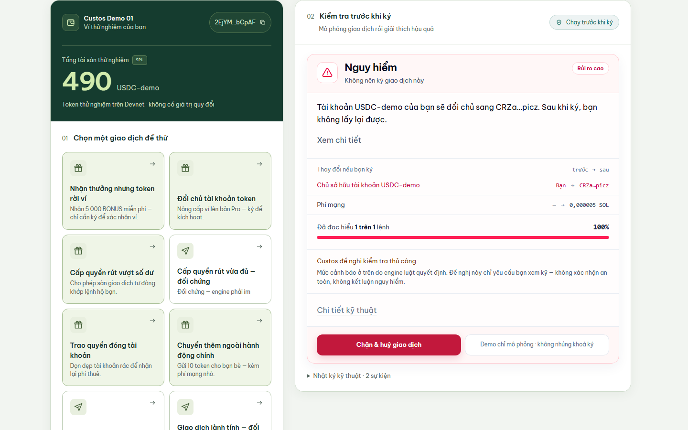
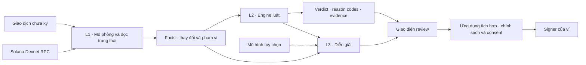

<div align="center">


# Custos

### Hiểu điều bạn sắp ký.

SDK phân tích giao dịch trước khi ký cho ví và dApp Solana.<br>
**Thấy thay đổi tài sản. Hiểu quyền được trao. Kiểm tra bằng chứng.**

[](https://github.com/NeitLN/Custos-Solana/actions/workflows/deploy.yml)
[](LICENSE)


[**Mở demo**](https://neitln.github.io/Custos-Solana/) · [**Xem video**](docs/nop-bai/video/CUSTOS-DEMO.mp4) · [**Tích hợp SDK**](packages/core/README.md) · [**Tài liệu**](docs/README.md)

</div>

---

## Số dư chưa đổi. Quyền kiểm soát có thể đã khác.

Một giao dịch không cần chuyển token ngay để tạo ra rủi ro. Trong ca đổi chủ nhóm dựng trên Devnet, tài khoản vẫn có **490 token**, nhưng mô phỏng cho thấy quyền chủ tài khoản sẽ chuyển sang địa chỉ khác nếu giao dịch được thực thi.

**Custos đưa những thay đổi đó đến trước bước ký.** Ví hoặc dApp gọi SDK; người dùng nhận được thay đổi tài sản, thay đổi quyền, lý do cảnh báo và phạm vi đã phân tích. Dữ kiện có thể mở để kiểm tra thêm.

<p align="center">
  <a href="https://neitln.github.io/Custos-Solana/">
    
  </a>
  <br>
  <em>Ảnh từ buổi demo local kết nối Devnet. Chỉ mô phỏng; không ký hoặc gửi giao dịch trong buổi quay.</em>
</p>

> **Bản thử nghiệm Devnet.** Kết quả mô phỏng phụ thuộc dữ kiện, trạng thái chain và phạm vi hỗ trợ. Không có cờ đỏ không phải bảo đảm an toàn.

## Khám phá sản phẩm

| Bạn muốn… | Mở tại đây |
|---|---|
| Hiểu sản phẩm trước khi thử | [Website giới thiệu](https://neitln.github.io/Custos-Solana/gioi-thieu.html) |
| Chạy tình huống và đọc kết quả | [Ví demo](https://neitln.github.io/Custos-Solana/) |
| Xem luồng yêu cầu từ một dApp giả lập | [Trang tấn công minh họa](https://neitln.github.io/Custos-Solana/tan-cong/) |
| Kiểm tra transaction | [Inspector](https://neitln.github.io/Custos-Solana/soi.html) |
| Xem số liệu và phạm vi đo | [Trang bằng chứng](https://neitln.github.io/Custos-Solana/so-lieu.html) |
| Xem bản ghi không phụ thuộc RPC | [Video demo](docs/nop-bai/video/CUSTOS-DEMO.mp4) · [Bộ nộp bài](docs/nop-bai/README.md) |

**Luồng nên thử:** đổi chủ tài khoản → mở dữ kiện trước/sau → cấp quyền vượt số dư → so với ca đối chứng. Danh sách đầy đủ nằm trong [registry kịch bản](apps/demo-wallet/src/kichBan.ts).

| Tình huống | Điều cần quan sát |
|---|---|
| Đổi chủ tài khoản token | Quyền thay đổi dù token chưa rời tài khoản |
| Approve 1.010 token, số dư 490 | Luật vượt số dư kích hoạt |
| Approve 250 token, số dư 490 | Ca đối chứng không kích hoạt luật vượt số dư; vẫn cần xét ý định người ký |
| Thiếu dữ kiện hoặc RPC lỗi | Hiển thị trạng thái không kiểm tra đủ; bên tích hợp không được tự chuyển sang ký |

Bản công khai không nhúng khóa ký. Tình trạng AI phụ thuộc cấu hình backend của từng bản triển khai: lượt AI thật trong bản ghi local không đồng nghĩa mọi demo public đều đã bật AI. Giao diện phân biệt nguồn diễn giải; khi không dùng mô hình, có câu tất định dự phòng.

## Custos làm gì?

- **Phân tích hậu quả:** đọc thay đổi số dư, owner, delegate và các dữ kiện hỗ trợ từ mô phỏng.
- **Cảnh báo có lý do:** engine luật trả mức cảnh báo, mã lý do và bằng chứng liên quan.
- **Nói rõ phần chưa hiểu:** trả coverage và giới hạn phân tích để người dùng biết phạm vi kết quả.
- **Diễn giải bằng tiếng Việt:** dùng câu tất định hoặc mô hình ngôn ngữ tùy chọn qua adapter.
- **Tích hợp trước bước ký:** SDK phục vụ đội ví/dApp; người hưởng lợi là người ký giao dịch.

## Kiến trúc: quan sát → đánh giá → diễn giải



| Thành phần | Trách nhiệm |
|---|---|
| [Core / L1](packages/core/src/l1/) | Mô phỏng qua RPC, bóc tách dữ kiện trong phạm vi hỗ trợ |
| [Core / L2](packages/core/src/l2/) | Áp luật để sinh `level`, lý do và bằng chứng |
| [AI / L3](packages/ai/) | Diễn giải facts; có câu tất định khi không dùng mô hình |
| [Ứng dụng tích hợp](vi-du-tich-hop/) | Hiển thị, áp chính sách, lấy xác nhận và kiểm nội dung trước khi gọi signer |

**AI không tạo hoặc sửa `level`.** Ranh giới được thể hiện trong hợp đồng dữ liệu, cách ghép kết quả và các kiểm tra đầu ra; không chỉ dựa vào prompt. Phần diễn giải vẫn có thể sai và cần được đánh giá riêng.

**Vì sao Solana?** Custos cần hiểu account, instruction và quyền SPL Token mà giao dịch tác động tới. Solana cung cấp trạng thái và môi trường thực thi; Custos dùng RPC simulation để quan sát trước khi broadcast. Phân tích chạy off-chain, hiện không có smart contract Custos riêng.

## Chạy tại máy

Dùng **Node 24.12.x** và **npm 11.6.2** theo [.nvmrc](.nvmrc) và [package.json](package.json). Trên Windows, có thể chọn Node bằng trình quản lý phiên bản bạn đang dùng; `nvm use 24.12.0` nếu dùng nvm-windows.

```bash
git clone https://github.com/NeitLN/Custos-Solana.git
cd Custos-Solana
npx npm@11.6.2 ci
npx npm@11.6.2 run check # typecheck + 1136 test
npm run vi
```

Mở **http://localhost:5188**. Trong terminal thứ hai, chạy trang dApp minh họa:

```bash
npm run tan-cong
```

Mở **http://localhost:5189**. Địa chỉ hiện trường Devnet có sẵn trong [hien-truong.json](apps/demo-wallet/public/hien-truong.json); không cần khóa API mô hình để chạy luồng diễn giải tất định.

| Lệnh | Mục đích | Cần mạng? |
|---|---|---|
| `npm run check` | Typecheck và bộ test | Có với một số ca CLI gọi RPC; các ca còn lại chạy cục bộ |
| `npm run replay-rpc` | Kiểm L1 bằng phản hồi RPC đã lưu | Không |
| `npm run doi-khang` | Các probe đối kháng | Không |
| `npm run thu-tich-hop:deterministic` | Kiểm consumer với fixture | Không |
| `npm run mo-phong-kichban` | Mô phỏng các kịch bản trên Devnet | Có, RPC |
| `npm run thu-tich-hop:devnet` | Kiểm lượt tích hợp live | Có, RPC |
| `npm run thu-goi` | Đóng gói và cài SDK từ ngoài monorepo | Có, npm registry |

RPC công cộng có thể chậm hoặc giới hạn yêu cầu. Một lượt live lỗi mạng không tự chứng minh engine phát hiện sai; kiểm nguyên nhân và đối chiếu với replay offline.

## Tích hợp SDK

Bắt đầu từ [hướng dẫn Core](packages/core/README.md) và [consumer mẫu](vi-du-tich-hop/). Đoạn dưới minh họa lời gọi phân tích, **không phải luồng ký hoàn chỉnh**:

```ts
import { inspect } from "@custos-solana/core";
import { boiThoiHan, dienGiaiKhongAI } from "@custos-solana/ai";

// connection: kết nối Devnet; transaction: giao dịch chưa ký.
// Lấy địa chỉ người dùng từ ví, không tin giá trị dApp tự khai.
const result = await inspect(
  { connection, interpret: boiThoiHan(dienGiaiKhongAI) },
  transaction,
  { locale: "vi", nguoiDung: walletPublicKey.toBase58() },
);
```

Trước khi nối với signer, ứng dụng phải xử lý timeout/lỗi, mức cảnh báo, `aiAdvisory`, coverage và việc giao dịch có thay đổi sau khi kiểm hay không. Không tự động ký chỉ vì `result.level === "safe"`. Xem [hợp đồng ký trong consumer](vi-du-tich-hop/src/ky.js) và [threat model](docs/bao-mat/THREAT-MODEL.md).

## Bằng chứng kỹ thuật

Các số sau là **snapshot đã lưu**, không phải cam kết hiệu năng hay độ chính xác trên mọi giao dịch. Nguồn: [so-lieu.json](apps/demo-wallet/public/so-lieu.json), [báo cáo kiểm chứng](docs/BAO-CAO-KIEM-CHUNG.md) và [quy cách dataset](docs/SEED-DATASET.md).

| Phạm vi | Kết quả đã lưu |
|---|---|
| Luật đã chạy | **14** — 12 theo đặc tả, cộng 2 luật sinh từ audit bảo mật |
| Test | **1136**, chạy trong `npm run check` |
| Mẫu trong bộ dữ liệu | **38** — cả 14 luật đều có mẫu kích hoạt; **cả 14 luật** đều có thêm ca đối chứng gần giống, chỉ khác đúng điều kiện quyết định |

<details>
<summary><strong>Đọc sâu: bằng chứng, hiệu năng và phạm vi từng phép đo</strong></summary>

| Bằng chứng | Chứng minh trong phạm vi nào? | Chưa chứng minh |
|---|---|---|
| **1136 test** tự động | Các hành vi và bất biến trong bộ kiểm | Chất lượng phát hiện trên traffic thực tế |
| **38 mẫu** đã gắn nhãn | Ca kích hoạt và đối chứng của luật | Khả năng khái quát sang tập độc lập |
| **Cohort công khai lưu offline** | Hành vi trên response đã lưu | Precision/recall; cohort chưa có ground truth |
| **Ví dụ tích hợp** | Consumer do nhóm dựng dùng SDK ngoài monorepo | Adoption hoặc nhu cầu bên thứ ba |
| **Đánh giá AI** — 13/13 bẫy bị chặn, 3/3 câu đúng đi qua | Bộ guard qua các ca đối kháng đã lưu; có đánh giá với mô hình thật | Mọi câu diễn giải đều đúng hoặc dễ hiểu hơn template |

Bảng đối chiếu rubric theo [ADR-0001](docs/adr/0001-doi-huong-technical-build.md); trọng số là cách tài liệu đó tổ chức bằng chứng, không phải điểm BGK đã chấm.

| Nhóm tiêu chí | Bằng chứng và nguồn |
|---|---|
| **30 %** độ khó và chiều sâu | **14** luật L2 · **1136** test trong bộ kiểm, một số ca CLI cần RPC · [ma trận hành vi](docs/bao-mat/MA-TRAN-HANH-VI.md) |
| **25 %** kiến trúc on-chain/off-chain | L1/L2/L3; engine giữ verdict, ứng dụng tích hợp giữ trách nhiệm ký; chưa có contract riêng |
| **25 %** Solana stack · hiệu năng | `inspect()` **639 ms** trong phép đo tích hợp đã lưu; [ngân sách RPC](docs/NGAN-SACH-RPC.md) |
| **20 %** demo và trình bày | FCP **88 ms** · bấm→thẻ **n=30**, trung vị **890 ms**, p95 quan sát **6005 ms** · [môi trường và cách đo](docs/HIEU-NANG.md) |

Số giao diện được đo trên Chromium headless; không suy rộng sang thiết bị thật hoặc mọi trình duyệt.

| Đo trên Devnet, 25/09/2026 — lượt pass gần nhất | |
|---|---|
| Cài đặt → kết quả đầu tiên | **8,4 giây** — trung vị 10 lượt trên 9 bản dựng, dải 6,6–13,2 |
| Dòng mã tích hợp | **31** |
| Một lượt kiểm tra | **639 ms** — trung vị 10 lượt trên 9 bản dựng |

Consumer này do nhóm dựng; kết quả đo ma sát tích hợp không chứng minh có khách hàng hay đối tác.

Measured, not estimated: **1136 tests** and **38 labelled samples** in the stored snapshot. These are scoped engineering checks, not an accuracy benchmark.

</details>

## Giới hạn hiện tại

- **Devnet-only:** runtime/demo hiện dành cho thử nghiệm; không tuyên bố sẵn sàng bảo vệ tài sản mainnet.
- **Phạm vi đọc hiểu chưa đầy đủ:** decoder và Token-2022 còn giới hạn. Coverage là phạm vi phân tích, không phải xác suất giao dịch an toàn.
- **Mô phỏng có giới hạn:** chỉ phản ánh dữ kiện quan sát được; trạng thái chain có thể thay đổi trước khi gửi giao dịch.
- **Tích hợp quyết định hiệu lực:** SDK không thể cưỡng chế một consumer cố ý bỏ qua kết quả hoặc ký nội dung khác.
- **AI là tùy chọn:** có đường tất định dự phòng; chưa có dữ liệu được nhóm xác nhận để kết luận AI cải thiện mức hiểu của người dùng.
- **Chưa có validation thị trường được xác nhận:** README không sử dụng số phỏng vấn trong tài liệu lịch sử làm traction. Chưa có bên thứ ba tích hợp được xác nhận.

### Phụ thuộc và an toàn

`npm audit` ngày 13/09/2026: **5 lỗ hổng — 5 high · 0 moderate** trong snapshot đã lưu.

Xem [artifact kiểm phụ thuộc](data/seed/lo-hong.json) để biết gói và thời điểm đo; đây không phải kết quả audit mới. Chạy `node scripts/do-lo-hong.mjs` để cập nhật phép đo. Xem [tài liệu bảo mật](docs/bao-mat/) để hiểu các giới hạn trước khi tích hợp. Không đưa khóa ký hoặc khóa API vào frontend, ảnh chụp hay issue công khai.

## Bước tiếp theo

- Đánh giá trên tập giao dịch độc lập có nhãn; đo riêng ca bỏ sót và cảnh báo không cần thiết.
- Củng cố endpoint, xử lý lỗi và khả năng quan sát khi chạy live.
- Mở rộng khả năng phân tích theo các ca còn thiếu bằng chứng.
- Tìm đội ví/dApp thử tích hợp và kiểm chứng cách người ký hiểu cảnh báo.

Đây là kế hoạch phát triển, chưa phải cam kết pilot hoặc partnership.

## Bản đồ repository

```text
apps/
  demo-wallet/       Ví mẫu, Inspector, website và trang số liệu
  trang-tan-cong/    dApp minh họa các tình huống đánh lừa người ký
packages/
  core/             Mô phỏng, facts, engine luật và API inspect
  ai/               Diễn giải tất định, adapter mô hình và kiểm đầu ra
  types/            Hợp đồng dữ liệu dùng chung
vi-du-tich-hop/     Consumer kiểm tích hợp ngoài monorepo
scripts/           Kiểm thử, replay, benchmark và đóng gói
data/              Dataset và bằng chứng kỹ thuật
docs/              Đặc tả, threat model, báo cáo và tài liệu pitch
```

## Tài liệu theo nhu cầu

| Người đọc | Bắt đầu từ |
|---|---|
| Ban giám khảo | [Báo cáo kiểm chứng](docs/BAO-CAO-KIEM-CHUNG.md) · [Bộ nộp bài](docs/nop-bai/README.md) |
| Đội ví/dApp | [Tích hợp Core](packages/core/README.md) · [Consumer mẫu](vi-du-tich-hop/README.md) |
| Người review kỹ thuật | [Đặc tả Core](docs/DAC-TA-CORE.md) · [Threat model](docs/bao-mat/THREAT-MODEL.md) · [Ma trận hành vi](docs/bao-mat/MA-TRAN-HANH-VI.md) |
| Người đóng góp | [Mục lục tài liệu](docs/README.md) · [Issues](https://github.com/NeitLN/Custos-Solana/issues) |

Khi báo lỗi, kèm bước tái hiện, commit, kịch bản, môi trường và kết quả mong đợi/thực tế. Không đính kèm khóa, token truy cập hoặc dữ liệu ví riêng tư.

<details>
<summary>Bối cảnh cuộc thi và lịch sử track</summary>

Custos phát triển cho **UniHackfest 2026 · Best Technical Build**, theo lựa chọn đã được chủ dự án xác nhận. Track đăng ký trên form lịch sử ngày 24/08 là **Best Product & Business**; giữ thông tin này để người đọc phân biệt hồ sơ cũ với hướng trình bày hiện tại. Xem [ADR đổi hướng](docs/adr/0001-doi-huong-technical-build.md) và [thông tin vòng thi](docs/cuoc-thi/THONG-TIN-VONG-HIEN-TAI.md) để đối chiếu hồ sơ, không suy tình trạng cập nhật biểu mẫu từ README.

</details>

## English overview

**Custos is a pre-signing transaction-intelligence SDK for Solana wallets and dApps.** It simulates transactions, surfaces asset and permission changes, and returns rule-based findings with supporting evidence and analysis coverage.

The deterministic engine owns the verdict. An optional language model explains structured facts; a deterministic explanation path remains available. The integrating application handles policy, consent and signing. Current runtime and demo scope is **Solana Devnet**, with no Custos smart contract and no claim of complete threat detection or confirmed third-party adoption.

**We are building Custos for Solana wallet users so they can understand asset and permission changes before signing.**

---

Built by **Team Too Hard** · [MIT License](LICENSE)
