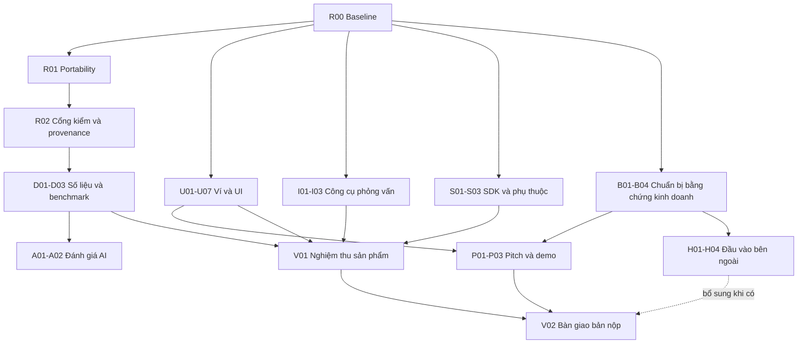

# Roadmap thực thi Custos dành cho Claude

**Mục tiêu:** sửa các lỗi đã được phát hiện, hoàn thiện sản phẩm và bộ bằng chứng dự thi, tăng sức thuyết phục cho track Best Product & Business. Thực hiện theo phụ thuộc và điều kiện nghiệm thu; không có lịch theo ngày, sprint hoặc ước lượng thời gian làm việc.

Tài liệu này là **kế hoạch triển khai**, không phải bằng chứng các việc bên dưới đã xong. Yêu cầu tạo roadmap chưa có nghĩa đã thực hiện các thay đổi trong roadmap.

## 1. Cách bắt đầu một phiên Claude

Prompt có thể dùng nguyên văn:

```text
Thực hiện ROADMAP-CLAUDE.md cho dự án Custos.

Đọc CLAUDE.md, ROADMAP-CLAUDE.md, docs/roadmap/TIEN-DO.md và
docs/roadmap/BAN-GIAO.md. Bắt đầu từ việc khả dụng đầu tiên chưa hoàn tất.
Tôi giao bạn phạm vi A/B/C/D cần thiết cho các công việc trong roadmap này;
được sửa các file liên quan trong repo, giữ nguyên thay đổi đang có của tôi.

Làm theo phụ thuộc và tiêu chí nghiệm thu, không theo mốc thời gian.
Đừng dừng ở phân tích hoặc kế hoạch khi đã có đủ điều kiện triển khai.
Với mỗi lỗi: tái hiện, tìm nguyên nhân, sửa, kiểm chứng rồi ghi bằng chứng.
Không tự commit, push, publish, deploy, gửi tin cho người khác hoặc dùng
dịch vụ tính phí khi tôi chưa cho phép việc đó. Tận dụng quyền đã được cấp,
không xin lại cho những thao tác trong phạm vi đã giao.

Việc thiếu đầu vào ngoài repo phải ghi WAIT_INPUT cùng đầu ra chuẩn bị sẵn;
tiếp tục việc độc lập khác. Không bịa phỏng vấn, pilot hoặc kết quả mô hình.
Cuối mỗi phiên cập nhật tiến độ, bằng chứng và bước tiếp theo để phiên sau
tiếp tục được ngay. Chỉ nói đã sửa/xong khi đã kiểm chứng đúng bản hiện tại.
```

Tài liệu đi kèm:

- [TIEN-DO.md](docs/roadmap/TIEN-DO.md): trạng thái duy nhất của từng mã công việc.
- [BAN-GIAO.md](docs/roadmap/BAN-GIAO.md): việc đang làm, kết quả gần nhất, trở ngại và bước kế tiếp.
- [Báo cáo đánh giá nguồn](docs/review/DANH-GIA-08-09-2026.md): lỗi F01–F11 và bằng chứng ban đầu.
- [CUSTOS.md](CUSTOS.md), [DAC-TA-CORE.md](DAC-TA-CORE.md), [DAC-TA-L3.md](DAC-TA-L3.md): ràng buộc sản phẩm và kiến trúc.

## 2. Nguyên tắc điều hành

### 2.1. Đọc đúng nguồn và đúng phiên bản

1. Yêu cầu hiện tại của chủ dự án quyết định phạm vi công việc; các chỉ dẫn hệ thống/công cụ vẫn phải được tuân thủ.
2. `CLAUDE.md` chứa quy tắc repo. Prompt khởi động ở trên giao một Claude phạm vi phối hợp A/B/C/D cho roadmap; không dùng phân vai cũ để dừng ở mỗi lần cần sửa file liên quan.
3. Quyết định sản phẩm đã khóa tiếp tục có hiệu lực. Nếu gặp mâu thuẫn thật về hành vi công khai, ghi quyết định cần làm rõ và tiếp tục các việc không phụ thuộc; không tự thay contract.
4. Code, test chạy mới và artifact có nguồn gốc quyết định trạng thái thực tế. Báo cáo cũ là đầu vào điều tra, không phải lý do tự tick DONE.
5. Lịch và yêu cầu BTC đọc từ `docs/cuoc-thi/THONG-TIN-VONG-HIEN-TAI.md`; roadmap không sao chép lịch sang nơi khác.

**Những điều dễ đọc nhầm:**

- Bộ kiểm ở phiên đánh giá có 403 unit test, 14 kiểm tích hợp tất định và 40 kiểm trình duyệt. Đây là các tập khác nhau; không cộng chúng thành một chỉ số độ chính xác.
- AI từng có biên bản thử mô hình thật trong `docs/bao-mat/`; artifact eval hiện hành lại chưa có đủ phép đo mô hình thật. Phải phân biệt thử nghiệm lịch sử với benchmark hiện tại, không viết “chưa từng chạy AI thật”.
- Đã có nhận diện cấu trúc một số chương trình DEX qua IDL. Đọc `docs/DECODER-TIEP-THEO.md` trước khi đề xuất decoder.
- Tài liệu nộp cũ ghi phiên bản AI chưa phát hành; có nguồn mới hơn ở `docs/PHAT-HANH-0.2.0.md`. Kiểm registry khi có mạng thay vì phát hành lại theo tài liệu cũ.
- Ngưỡng usability trong giao thức vòng 2 đã chốt; không thay bằng một mục tiêu phần trăm trong báo cáo góp ý.

### 2.2. Bất biến phải giữ

- `level` do L2 quyết định; mô hình không tạo/sửa mức cảnh báo hoặc xác nhận giao dịch an toàn.
- `expectedAction` là lời khai không đáng tin. Khớp không làm giảm nghi ngờ; lệch có thể yêu cầu xem kỹ.
- Giữ logic xử lý thiếu dữ liệu và thiếu ngữ cảnh người dùng của core; không hạ cảnh báo để làm demo đẹp hoặc tăng số ca xanh.
- Coverage mô tả phần đọc được, không phải phần trăm an toàn; không đổi mẫu số để cải thiện số liệu.
- Diff chỉ mô tả hậu quả đo được. Mô phỏng thất bại không được biến dữ liệu thiếu thành số dư bằng 0.
- Demo Devnet, không tài sản thật; không thêm smart contract, token dự án hoặc mainnet runtime.
- Bản công khai không nhúng khóa ký/API key. Mock chỉ dùng khi có nhãn rõ ràng và không trộn vào số đo live.
- Không thay công khai `InspectResult`, không tái thiết kế toàn bộ frontend hoặc nâng cấp nền Solana quy mô lớn trong nhóm việc bắt buộc.

### 2.3. Quyền thao tác và cách xử lý trở ngại

- Khi đã được giao thực hiện roadmap: tự đọc/sửa file trong phạm vi, chạy kiểm thử, build, tạo artifact cục bộ và khắc phục lỗi thông thường. Không xin duyệt lại từng nút, câu chữ hoặc từng bước kiểm tra.
- Không xóa thay đổi có sẵn; không `reset --hard`, không dọn các thư mục chưa xác minh. Ghi diff ban đầu ở R00.
- Không commit/push/publish/deploy, deprecate gói npm hoặc gửi thông điệp cho người mua/BTC nếu chưa có quyền tương ứng. Hoàn thiện bản nháp/artifact để người dùng duyệt hành động cuối cùng.
- Không mặc định “có API key” đồng nghĩa với “được dùng ngân sách không giới hạn”. Kiểm quyền và giới hạn chi phí đã có; thiếu thì chỉ chặn nhánh cần chúng.
- Giữ quyền đã được cấp qua các phiên trong sổ bàn giao. Phân biệt lỗi sản phẩm, mạng, công cụ, quyền truy cập và dữ liệu thiếu; không lấy lỗi sandbox làm lỗi sản phẩm.
- Chạy tuần tự mặc định. Chỉ dùng nhiều agent khi môi trường và chỉ dẫn hiện hành cho phép; tách file sở hữu, không cho hai agent sửa cùng file đồng thời.

### 2.4. Vòng lặp làm việc và trạng thái

| Trạng thái | Nghĩa |
|---|---|
| `TODO` | Chưa bắt đầu hoặc chưa đủ phụ thuộc. |
| `DOING` | Đang triển khai; phải ghi bước tiếp theo cụ thể. |
| `VERIFY` | Đã thay đổi nhưng kiểm chứng chưa đủ hoặc đang chạy. |
| `DONE` | Đạt tiêu chí, có bằng chứng thuộc phiên bản hiện hành. |
| `WAIT_INPUT` | Cần dữ liệu/quyền/công cụ ngoài khả năng hiện tại; ghi chính xác điều kiện mở lại. |
| `NOT_NEEDED` | Điều tra mới chứng minh không cần thay đổi; có căn cứ và người/phiên ghi quyết định. |

Chọn việc có phụ thuộc `DONE` hoặc `NOT_NEEDED` hợp lệ. Không chờ mọi việc của một nhóm xong nếu có nhánh khác làm độc lập được. `WAIT_INPUT` không phải hoàn tất; không tính xanh trong tổng nghiệm thu. Chỉ dùng `NOT_NEEDED` khi nguyên nhân không còn hoặc nhánh không áp dụng, không dùng để che lỗi hay thiếu người mua.

**Ngoại lệ cho tổng hợp và nghiệm thu:** V01 được chạy từng phần đã đủ điều kiện khi các phần khác WAIT_INPUT; chỉ đóng V01 khi đủ toàn bộ tiêu chí bắt buộc. V02 được lập khi trạng thái đầu vào đã xác định, kể cả VERIFY/WAIT_INPUT. V02 DONE nghĩa là **báo cáo bàn giao đã đầy đủ và trung thực**, không đổi trạng thái các việc còn mở, không đồng nghĩa sản phẩm/hồ sơ đã đạt toàn bộ. Nhờ vậy thiếu Linux, người mua, video hoặc API key không làm mất khả năng bàn giao công việc đã hoàn thành.

Trong một việc: đọc → tái hiện/đo → chọn cách sửa nhỏ nhất đáp ứng yêu cầu → kiểm có ý nghĩa → xem diff → ghi kết quả. Với lỗi hành vi quan trọng, có kiểm hồi quy tái hiện trước sửa. Không thêm test chỉ để dò đúng một chuỗi CSS hoặc tăng số lượng test; thay đổi tài liệu/câu chữ nhỏ có thể kiểm trực tiếp.

Khi hết ngữ cảnh hoặc cần bàn giao: cập nhật hai sổ trước khi dừng. Không chuyển một việc thành DONE chỉ để kết thúc phiên. Nếu tất cả việc khả dụng đã xong, tổng hợp phần đã kiểm và danh sách đầu vào còn thiếu; không chạy lặp kiểm thử vô ích.

## 3. Bản đồ công việc và phụ thuộc

Các vai chỉ mô tả chuyên môn: **A** core/SDK, **B** frontend/Devnet, **C** diễn giải/AI, **D** dữ liệu/kinh doanh/hồ sơ. Một Claude có thể thực hiện nhiều vai trong phạm vi được giao.

| Nhóm | Mã | Đầu ra |
|---|---|---|
| Nền kiểm chứng | R00–R02 | Baseline, kiểm thử đa nền tảng, bằng chứng có nguồn gốc. |
| Ví và giao diện | U01–U07 | Luồng phân tích/gửi/huỷ/đầu vào lỗi/mobile hoạt động rõ ràng. |
| Công cụ phỏng vấn | I01–I03 | Deadline, bảo toàn dữ liệu, công cụ đo đúng giao thức. |
| SDK và phụ thuộc | S01–S03 | Đánh giá advisory, bản vá phù hợp, tích hợp ngoài repo qua. |
| Dữ liệu và chất lượng đo | D01–D03 | Claim nhất quán, benchmark có nhãn, số đo hiệu năng đúng nghĩa. |
| AI | A01–A02 | Bộ đánh giá tái lập; phép đo mô hình thật khi đủ điều kiện. |
| Sản phẩm/kinh doanh | B01–B04 | Bộ tiếp cận người mua, pilot, usability và mô hình doanh thu. |
| Hồ sơ/demo | P01–P03 | Pitch, video/bằng chứng, artifact phát hành cục bộ. |
| Nghiệm thu | V01–V02 | Bản sản phẩm đã kiểm và kết luận sẵn sàng tách từng phạm vi. |
| Đầu vào bên ngoài | H01–H04 | Người dùng, người mua, đối tác độc lập, phản hồi BTC. |



Sơ đồ chỉ chỉ ra các nhánh lớn; phụ thuộc cụ thể trong từng thẻ là nguồn thực thi. Thiếu A02/H01–H04 không ngăn sửa sản phẩm hoặc tạo bản nháp hồ sơ trung thực.

## 4. Nền kiểm chứng

### R00 — Ghi baseline và xác minh phạm vi

**Vai:** A/B/D. **Phụ thuộc:** không. **Mức:** bắt buộc, làm đầu tiên.

**Đọc/sửa:** `CLAUDE.md`, báo cáo nguồn, `package.json`, cấu hình build, `.github/workflows/deploy.yml`; chỉ ghi artifact kiểm chứng và sổ tiến độ ở bước này.

**Thực hiện:**
1. Ghi HEAD, trạng thái working tree và phiên bản Node/npm/browser/axe. Không in biến môi trường hoặc khóa.
2. Đọc tài liệu hiện hành, xác minh các thay đổi xuất hiện sau báo cáo; lập đối chiếu F01–F11 còn tồn tại hay đã được sửa.
3. Chạy `npm run check`; nếu gặp đúng lỗi `unzip`, ghi lại và dùng PATH tạm đã xác minh để lấy baseline, rồi làm R01.
4. Build hai app, chạy tích hợp tất định; chạy browser/live khi đủ mạng. Đọc tác động ghi file của script trước khi chạy để không ghi đè bằng chứng gốc hoặc dữ liệu người dùng.
5. Chốt danh sách việc khả dụng đầu tiên, nguồn canonical và các quyền đã được cấp.

**Đạt khi:** có baseline không che lỗi, nguyên nhân môi trường tách khỏi sản phẩm, F01–F11 có vị trí điều tra. Test count cũ không được dùng làm ngưỡng cố định cho mã mới.

### R01 — Bỏ phụ thuộc ngầm vào `unzip` của máy lập trình [F09]

**Vai:** A/D. **Phụ thuộc:** R00.

**File:** `packages/core/test/artifactNopBai.test.ts`, `package.json`, lockfile, hướng dẫn chạy kiểm thử.

**Thực hiện:** Tái hiện PowerShell không có `unzip` trong PATH. Chọn thư viện ZIP khai báo rõ hoặc phương án đa nền tảng phù hợp; đọc đúng XML trong `.pptx`, không nuốt lỗi để test xanh. Tránh thêm phụ thuộc lớn chỉ cho một lần giải nén.

**Đạt khi:** kiểm deck chạy trên Windows không có `unzip`; deck chứa số liệu sai vẫn làm test đỏ; deck hợp lệ qua. Hướng dẫn setup không yêu cầu người dùng tự đoán PATH. Dùng cách đọc ZIP đa nền tảng và kiểm thêm Linux khi có môi trường sẵn; nếu chưa có Linux, ghi rõ “chưa kiểm Linux” để V01 xét phạm vi, không chặn R02/S03 và không tuyên bố đã kiểm trên cả hai nền tảng. Không tự push chỉ để kích hoạt CI.

### R02 — Cổng kiểm chứng và nguồn gốc artifact

**Vai:** A/D. **Phụ thuộc:** R00, R01.

**File:** `scripts/kiem-san-pham.ts`, `scripts/kiem-nop-bai.ts`, `scripts/toTien.ts`, `scripts/tao-so-lieu.ts`, `scripts/dong-bo-so-tai-lieu.mjs`, bộ browser.

**Thực hiện:** Kiểm các script đang đọc phép đo cũ, chạy phép đo mới hay tạo/sửa artifact. Phân biệt pass, fail, thiếu công cụ/mạng, cũ, chưa đo. Giữ cổng sản phẩm riêng với cổng hồ sơ. Bổ sung output directory hoặc chế độ không ghi nếu cần, thay vì sao chép script mới gần giống.

**Đạt khi:** mỗi số liệu có phạm vi đo, phiên bản công cụ, dấu vết mã và kết quả lệnh. Nếu working tree có thay đổi, ghi dấu vết file/diff hoặc hash nội dung; chỉ HEAD không đủ. Thay đổi tài liệu thuần không tự làm bằng chứng hành vi vô hiệu; thay đổi UI liên quan phải khiến phép đo UI được đánh giá lại. Không tự commit để làm cổng xanh.

## 5. Ví mẫu và trải nghiệm quyết định

### U01 — Đưa kết quả vào viewport và luồng bàn phím [F01]

**Vai:** B. **Phụ thuộc:** R00.

**File:** `apps/demo-wallet/src/App.tsx`, `CanhBao.tsx`, `style.css`, bộ kiểm browser.

**Thực hiện:** Tái hiện tại 375×812 có lịch sử giao dịch. Đưa khu vực kiểm tra lên trước lịch sử trên mobile hoặc rút gọn lịch sử; dùng ref để đưa trạng thái/kết quả vào vùng nhìn. Quản lý focus tại kết quả/tiêu đề, tránh lặp nhảy cuộn do dữ liệu nền. Tôn trọng reduced motion và thao tác người dùng đã chủ động cuộn.

**Đạt khi:** 320/375/768/1440 px đều thấy trạng thái sau thao tác; Tab/Enter tới được hành động phù hợp, không mất focus về body khi nút bị disabled; kết quả xuất hiện không bị che. Ca đỏ, vàng, xanh và lỗi đều được kiểm, không chỉ card danger.

### U02 — Trạng thái ký/gửi/xác nhận và chặn gửi lặp [F02]

**Vai:** B/A. **Phụ thuộc:** R00.

**File:** `App.tsx`, `CanhBao.tsx`, `vi.ts`, `scripts/coHan.ts`, test frontend phù hợp.

**Thực hiện:**
1. Tách trạng thái phân tích khỏi trạng thái gửi; gắn kết quả với đúng giao dịch đang chờ.
2. Khóa thao tác gửi đồng thời; hiển thị đang ký, đang gửi, đang xác nhận, thành công, thất bại và chưa biết kết quả.
3. Lỗi ký/gửi phải hiện cạnh thao tác, có giải thích và đường tiếp tục; log chỉ là thông tin bổ sung.
4. Giữ signature khi đã gửi; mất phản hồi không tự coi giao dịch thất bại và gửi bản khác ngay. Truy vấn trạng thái trước khi quyết định gửi lại.
5. Xử lý blockhash hết hạn và kết quả mô phỏng cũ. Nếu làm mới giao dịch, tái kiểm tra và yêu cầu quyết định mới khi hậu quả thay đổi; không ký bytes khác với thứ vừa cho người dùng xem.
6. Deadline không đồng nghĩa hủy RPC: bỏ qua kết quả muộn của lượt cũ, không cho nó ghi đè trạng thái mới.

**Đạt khi:** test RPC từ chối gửi có lỗi nhìn thấy; click kép chỉ có một lần gửi đang chạy; trường hợp đã gửi nhưng mất mạng giữ đúng trạng thái chưa rõ; blockhash hết hạn có đường hồi phục. Kiểm lỗi bằng RPC intercept/fixture, không phá hiện trường devnet dùng chung. Bản công khai vẫn không bật ký.

### U03 — Validate hiện trường và giữ giao diện hồi phục được [F03]

**Vai:** B/A. **Phụ thuộc:** R00.

**File:** `hienTruong.ts`, `App.tsx`, `main.tsx`, nơi trang tấn công đọc hiện trường.

**Thực hiện:** Validate JSON tại biên: trường bắt buộc, public key, `decimals`, lượng nguyên không âm và cấu hình RPC hợp lệ. Phân biệt chưa có file với sai cấu trúc/lỗi mạng. Thêm error boundary hợp lý để lỗi render không chỉ còn màn trắng; không dùng boundary thay cho validation.

**Đạt khi:** `{}`, `null`, array, JSON lỗi, địa chỉ sai, thiếu trường và lỗi tải đều có trạng thái rõ; khóa thao tác cần hiện trường hợp lệ; retry sau khi file được sửa hoạt động. Không in URL chứa secret vào thông báo hoặc log công khai.

### U04 — Yêu cầu từ dApp có lỗi phải được phản hồi [F06]

**Vai:** B/A. **Phụ thuộc:** R00, U03.

**File:** `yeuCauNgoai.ts`, `App.tsx`, test parser/handoff.

**Thực hiện:** Dùng kết quả phân biệt không có yêu cầu / hợp lệ / không hợp lệ. Đặt giới hạn đầu vào dựa trên giao dịch và metadata hỗ trợ. Validate lời khai và map ký hiệu token, giữ chúng là dữ liệu không đáng tin. Dữ liệu lỗi không làm mất cảnh báo đang có hoặc âm thầm thành màn hình nghỉ.

**Đạt khi:** base64 hỏng, giao dịch không giải mã được, metadata sai kiểu, payload quá dài có thông báo rõ; payload hợp lệ vẫn phân tích đúng; lời khai khớp không hạ mức, ký hiệu token không chèn lời trấn an. URL mặc định không yêu cầu vẫn vào ví bình thường.

### U05 — Xác nhận kết quả huỷ [F07]

**Vai:** B/C. **Phụ thuộc:** U01, U02.

**File:** `App.tsx`, vùng trạng thái kết quả.

**Thực hiện:** Thêm xác nhận ngắn rằng yêu cầu hiện tại đã bị huỷ và chưa gửi khi đúng sự thật; có “Thử giao dịch khác”. Nếu đã gửi, hành động đóng UI không được gọi là huỷ giao dịch on-chain.

**Đạt khi:** có thông báo nhìn thấy và đọc được qua `role=status`; không cần mở nhật ký; focus quay về hành động hợp lý; không còn giao dịch cũ có thể vô tình được ký.

### U06 — Vùng bấm, câu chữ và thứ tự thông tin [F08]

**Vai:** B/C. **Phụ thuộc:** U01, U05.

**File:** `CanhBao.tsx`, `App.tsx`, `style.css`, `HauQua.tsx` khi có liên quan.

**Thực hiện:** Mở rộng vùng bấm mục chi tiết/link độc lập, giữ hệ màu hiện có. Ưu tiên kết luận → hậu quả → giới hạn → hành động. Đưa giải thích dài về implementation AI/khóa vào phần kỹ thuật. Làm rõ đây là ví mẫu tích hợp SDK. Không xóa nhãn mock/Devnet hoặc câu giới hạn coverage.

**Đạt khi:** CTA và các thao tác độc lập dễ bấm ở mobile, mục tiêu 44 px; không tính input ẩn riêng khỏi label là lỗi. Kiểm contrast bằng axe sau chuyển cảnh, kiểm keyboard, zoom/text lớn, nội dung dài. Không tự coi mọi vùng dưới 44 px là vi phạm WCAG AA. Không tạo test dò từng class CSS.

### U07 — Cấu hình RPC và handoff nhất quán

**Vai:** B/A. **Phụ thuộc:** U03, U04.

**File:** `apps/demo-wallet/src/hienTruong.ts`, `apps/trang-tan-cong/src/App.tsx`, `blockhash.ts`, cấu hình hai app và tài liệu demo.

**Thực hiện:** Điều tra trước khi sửa: ví dùng `chonRpc`, còn trang tấn công có các lời gọi trực tiếp `ht.rpc`; phân giải URL local có điều kiện `localhost`. Kiểm localhost/127.0.0.1, đường dẫn con khi build, popup bị chặn, tab nền/blockhash cũ và phương án RPC riêng của máy demo. Dùng cấu hình chia sẻ ở vị trí phù hợp, không import app này vào app khác.

**Đạt khi:** hai app dùng đúng endpoint được cấu hình mà không lộ key vào production; handoff hoạt động với môi trường được hỗ trợ, có fallback khi popup không mở. Nếu phiên bản mới đã giải quyết đầy đủ, ghi `NOT_NEEDED` với bằng chứng, không refactor vì roadmap có một thẻ.

## 6. Công cụ phỏng vấn đáng tin cậy

### I01 — Deadline, retry và hủy lượt tải cũ [F04]

**Vai:** B. **Phụ thuộc:** R00, U03.

**File:** `PhongVan.tsx`, `scripts/coHan.ts` nếu cần; ưu tiên tái sử dụng helper.

**Thực hiện:** Bọc cả đọc hiện trường → blockhash → inspect trong một ngân sách; báo lỗi đúng loại và có thử lại. Cleanup hoặc bỏ qua kết quả muộn, xử lý StrictMode. Không tự dùng mock cho dữ liệu nghiên cứu thật.

**Đạt khi:** RPC treo có deadline tổng đúng cấu hình; trả lời muộn không ghi đè lượt mới; retry phục hồi; biểu mẫu đo chỉ mở khi màn hình mục tiêu hợp lệ.

### I02 — Validate, lưu và khôi phục dữ liệu phỏng vấn [F05]

**Vai:** B/D. **Phụ thuộc:** R00.

**File:** `PhongVan.tsx`, `phongVan.ts`, `apps/demo-wallet/test/phongVan.test.ts`.

**Thực hiện:** Kiểm array và schema từng bản ghi, version dữ liệu, cách migration. Bảo toàn raw data lỗi để người dùng xuất/khôi phục. Bắt lỗi ghi storage; không báo đã lưu nếu ghi thất bại. Bổ sung tải JSON trực tiếp khi clipboard không hoạt động; không gửi dữ liệu lên dịch vụ ngoài.

**Đạt khi:** JSON lỗi, `{}`, `null`, phiên bản cũ, bản ghi thiếu trường, storage bị từ chối/quota đầy và clipboard lỗi không làm mất dữ liệu im lặng. Không xuất tên/email/khóa vào repo công khai. Fixture thử nghiệm có nhãn synthetic riêng.

### I03 — Công cụ đo khớp giao thức vòng 2

**Vai:** B/C/D. **Phụ thuộc:** I01, I02, U06.

**File:** `PhongVan.tsx`, `phongVan.ts`, `docs/GIAO-THUC-PHONG-VAN-VONG-2.md`, validator tương ứng.

**Thực hiện:** So công cụ với câu hỏi/field đã khóa: nguyên văn trước chấm, quyết định và lý do, hiểu coverage, đọc nhầm phí, kênh và phiên bản UI. Phân biệt khu cho người phỏng vấn với màn hình người tham gia; xử lý nút huỷ/no-op hiện tại sao cho không làm người tham gia tưởng hành động đã được thực hiện thật. Nếu thêm ca lành tính/khuyết coverage, lưu thành phần mở rộng nghiên cứu riêng.

**Đạt khi:** xuất file có đủ trường cho giao thức; dữ liệu cũ vẫn đọc được; không trộn mẫu UI khác nhau hoặc trộn kịch bản mới vào kết quả so sánh vòng 1. Giao thức và ngưỡng chấm không được sửa sau khi xem câu trả lời.

## 7. SDK và rủi ro phụ thuộc

### S01 — Phân loại từng advisory theo đường mã chịu ảnh hưởng [F11]

**Vai:** A. **Phụ thuộc:** R00.

**File:** package manifests/lockfile, `docs/PHU-THUOC.md`, báo cáo bảo mật, script đo lỗ hổng.

**Thực hiện:** Chạy npm audit mới; đối chiếu advisory chính thức, gộp mục kế thừa cùng nguyên nhân. Ghi gói trực tiếp/gián tiếp, Node/browser/dev tool, entry point, đầu vào có thể chạm tới và điều chưa xác minh. Không tuyên bố exploitable chỉ dựa trên nhãn high.

**Đạt khi:** từng advisory có phương án: vá tương thích / giảm phơi nhiễm có kiểm chứng / nghiên cứu migration / chờ quyết định chấp nhận. Không dùng `npm audit fix --force` để lấy báo cáo xanh bằng downgrade hoặc breaking change không kiểm soát.

### S02 — Vá dependency trong phạm vi tương thích

**Vai:** A/B. **Phụ thuộc:** S01, R01.

**File:** gói có liên quan, lockfile, integration/build tests.

**Thực hiện:** Áp dụng bản vá tương thích được xác minh; kiểm tác động bundler và SDK consumer. Nếu chưa có bản vá phù hợp, hoàn thiện đề xuất với đường mã, biện pháp tạm và rủi ro còn lại. Tách việc chấp nhận rủi ro hoặc thay nền lớn sang quyết định của chủ dự án; tiếp tục nhánh độc lập.

**Đạt khi:** thay đổi có bằng chứng không làm hỏng engine, tarball và build; hoặc ghi đúng `WAIT_INPUT` cho quyết định còn thiếu. Không đổi `WAIT_INPUT` thành DONE chỉ vì tài liệu đã mô tả rủi ro.

### S03 — Tích hợp SDK từ góc nhìn người ngoài

**Vai:** A/C. **Phụ thuộc:** R01; kiểm lại sau mọi thay đổi core/AI/dependency áp dụng từ S02.

**File:** `scripts/thu-goi-nguoi-ngoai.mjs`, `scripts/thu-goi-registry.mjs`, `vi-du-tich-hop/`, README các package.

**Thực hiện:** Cài tarball vào consumer riêng, chạy JS/TypeScript, kiểm export/optional peer dependency và lỗi thiếu adapter. Kiểm ca nguy hiểm, lành tính, timeout và L3 lỗi theo đúng quyết định chặn/hỏi của ví. Đọc mẫu tích hợp để bảo đảm bắt exception/deadline, không biến lỗi thành cho ký.

**Đạt khi:** tarball dùng được và ca đối kháng có đối chứng dương; không cần import source của monorepo. Nếu local đổi sau lần publish, ghi local khác registry thay vì tự publish. Phép thử do Claude chạy không được gọi là pilot bên thứ ba.

## 8. Số liệu, benchmark và hiệu năng

### D01 — Một nguồn cho claim hiện hành [F10]

**Vai:** D/C/A. **Phụ thuộc:** R02.

**File:** README gốc, `CLAUDE.md`, `PITCH-VA-PHAN-BIEN.md`, `docs/nop-bai/README.md`, `docs/AI-EVALUATION.md`, `scripts/tao-deck.cjs`, script đồng bộ và trang số liệu.

**Thực hiện:** Lập bảng claim → artifact/nguồn → phạm vi → trạng thái hiện hành. Sửa 29/30 dòng, 6/6 vs 13/13, version registry, từ “trần cứng” 400 token và các câu về đối thủ. Phân biệt thử AI lịch sử với eval hiện tại. Tài liệu lịch sử giữ nguyên hoặc đánh dấu rõ, không viết lại lịch sử thành kết quả mới.

**Đạt khi:** người chỉ đọc một trong README/deck/trang số liệu vẫn hiểu cùng tình trạng; mọi mẫu số và phiên bản rõ. Dùng generator hiện có cho số lặp nhiều nơi; không thêm test bắt chuỗi cho từng câu văn. Rebuild deck khi thay generator.

### D02 — Benchmark phát hiện và phạm vi chưa kiểm được

**Vai:** A/D. **Phụ thuộc:** R02.

**File:** `SEED-DATASET.md`, `data/seed/`, script cohort/coverage, báo cáo benchmark mới khi cần.

**Thực hiện:**
1. Kiểm nguồn và nhãn của từng mẫu, tách synthetic/lịch sử, dương/âm/không đủ dữ liệu.
2. Thiết kế tập giữ lại trước khi tuning; ca đối chứng gần giống chỉ khác điều kiện quyết định.
3. Ghi tất cả mẫu bị loại cùng lý do. Tách “không kiểm được” khỏi “phát hiện sai”.
4. Báo confusion matrix chỉ trên tập có nhãn chuẩn độc lập với verdict; tách lớp không biết, số mẫu và phạm vi chương trình.
5. Giữ cohort so sánh cố định; thay corpus phải version và chạy lại hai phía trên cùng corpus.

**Đạt khi:** report tái lập, không loại mẫu khó để nâng điểm; coverage không được gọi là accuracy; bộ 14 luật vẫn giữ dương và đối chứng. Nếu chỉ có dữ liệu synthetic thì kết luận đúng phạm vi synthetic, phần dữ liệu độc lập còn thiếu ghi vào tiến độ.

### D03 — Đo và cải thiện độ trễ, tải trang

**Vai:** B/A. **Phụ thuộc:** R02, U01, U02, U07.

**File:** script đo/integration, Vite config, imports nặng, `HoatDong.tsx`, trang số liệu.

**Thực hiện:** Đo riêng tải trang, bấm → kết quả, số RPC, retry, warm/cold và endpoint. Giữ số mẫu và thiết bị/mạng trong report; ít mẫu báo median/max, không khoe p95 thiếu ý nghĩa. Chỉ tối ưu sau khi xác định nút thắt: defer lịch sử, tải module theo nhu cầu, giảm RPC trùng hoặc caching đúng phạm vi; không cache verdict giữa giao dịch/trạng thái tài sản khác nhau.

**Đạt khi:** không có lỗi luồng chính do tối ưu; kết quả có thể so trước/sau trên cùng điều kiện. Timeout hiện hữu không bị kéo dài chỉ để che trễ. Nếu mạng không đo được, tooling vẫn hoàn thiện và phép đo live ghi WAIT_INPUT, không điền số từ lần khác.

## 9. AI có căn cứ và có phép đo

### A01 — Bộ eval sẵn sàng chạy, không cần secret để kiểm bộ chắn

**Vai:** C/A/D. **Phụ thuộc:** R02, D02.

**File:** `packages/ai/src/moHinh.ts`, `anthropic.ts`, `index.ts`, `scripts/eval-ai.ts`, `scripts/do-token-mo-hinh.ts`, test và tài liệu eval.

**Thực hiện:** Kiểm bộ chắn và đường fallback bằng ca đối kháng/đối chứng. Ghi cấu hình model, prompt, facts, version, token vào/ra, số retry, fallback, lỗi API và thời gian. Validate cấu hình token; gọi đúng “giới hạn trong cấu hình”, không mặc định chi phí toàn lượt chỉ có output. Giữ kết quả live trước đó nếu chạy offline, hoặc lưu các loại run riêng để không ghi đè thành chưa đo.

**Đạt khi:** lệnh offline chạy không cần key, fake model có nhãn; địa chỉ/số/quan hệ sai không qua các ca đã khóa, câu đúng không bị chặn sạch; verdict giữ nguyên khi L3 lỗi. Kết quả giả không bao giờ được trình bày như live model. Không tùy tiện tăng số token theo mặc định của một skill.

### A02 — Eval mô hình thật và giá trị tăng thêm

**Vai:** C/D. **Phụ thuộc:** A01; cần quyền gọi dịch vụ, secret đã cấu hình và ngân sách rõ.

**Thực hiện:** Kiểm tài liệu/giá hiện hành khi thực thi, không cố định model hoặc giá theo ký ức. Chạy tập đã khóa với giới hạn chi phí/số request; lưu raw đã lọc nhạy cảm và chấm tính đúng. So với câu mẫu cùng facts về chất lượng, tỷ lệ fallback, token, độ trễ. Phần hiểu của người dùng lấy từ nghiên cứu thật, không lấy Claude tự chấm thay người tham gia.

**Đạt khi:** có kết quả thật, nguồn gốc, giới hạn và kết luận có/không có lợi ích. Thiếu key/quyền/ngân sách → WAIT_INPUT, giữ A01 hoàn tất và tiếp tục hồ sơ với mô tả đúng giới hạn. Không bắt buộc thêm LLM vào runtime công khai để hoàn thành việc này.

## 10. Chuẩn bị bằng chứng sản phẩm và kinh doanh

### B01 — Bộ làm việc với người quyết định mua

**Vai:** D. **Phụ thuộc:** R00.

**File:** `docs/PHONG-VAN-NGUOI-MUA.md` và schema/validator trong `scripts/kiem-nguoi-mua.ts`.

**Thực hiện:** Chuẩn bị ICP cụ thể, bộ câu hỏi vấn đề hiện tại/giải pháp đang dùng/blocker/người duyệt/ngân sách, mẫu lời mời ngắn và bảng ghi phản hồi. Tái sử dụng tài liệu hiện có, không dựng form thứ hai cùng mục đích. Có thể lập danh sách tổ chức phù hợp từ nguồn công khai; không tự gửi tin.

**Đạt khi:** người của đội cầm bộ tài liệu đi hỏi được ngay, xác định được ai có quyền quyết định; dữ liệu mẫu ghi synthetic. Tình trạng không phỏng vấn kỳ này được ghi như hạn chế hiện tại, không bị xóa chỉ vì roadmap đề xuất phỏng vấn.

### B02 — Bộ tự thử tích hợp cho đối tác

**Vai:** A/D. **Phụ thuộc:** S03.

**File:** `vi-du-tich-hop/`, README các gói, tài liệu pilot mới nếu chưa có.

**Thực hiện:** Viết bài bắt đầu từ thư mục trống, phiên bản SDK và câu hỏi bàn giao; có sample dữ liệu phù hợp, đường xử lý lỗi và tiêu chí chạy được. Ghi các bước cần đội hỗ trợ, cách thu lỗi đã lọc secret và mẫu biên bản tích hợp. Nêu rõ SDK nằm trước quyết định ký ở phía ví tin cậy; dApp độc hại không phải nơi cưỡng chế bảo vệ.

**Đạt khi:** Claude kiểm bài hướng dẫn từ consumer độc lập thành công; partner có thể tự làm không cần biết monorepo. Bộ kit hoàn tất không đồng nghĩa H03 có đối tác sử dụng.

### B03 — Bộ usability trên UI đã chốt

**Vai:** B/C/D. **Phụ thuộc:** I03, U06.

**File:** giao thức vòng 2, hướng dẫn người phỏng vấn, form xuất dữ liệu và script phân tích.

**Thực hiện:** Khóa UI bằng dấu vết mã và ảnh, giữ bốn câu và ngưỡng hiện có: mất tài sản ≥80%, mất quyền kiểm soát ≥70%, hiểu coverage thành an toàn ≤10%, ký nhầm chỉ vì phí nhỏ =0. Giữ tối thiểu 12 người mới theo giao thức. Ca lành tính/khuyết coverage thêm thành nhóm đánh giá riêng, không âm thầm đổi nghiên cứu.

**Đạt khi:** bộ công cụ và cách chấm tái lập; báo cáo trống sẵn sàng nhập dữ liệu thật, synthetic tách riêng. Nhánh A/B AI chỉ mở theo điều kiện của giao thức, không chia nhóm quá nhỏ để cố có biểu đồ.

### B04 — Mô hình doanh thu và cách kiểm giả thuyết

**Vai:** D. **Phụ thuộc:** B01, B02; cập nhật thêm khi H02/H03 có dữ liệu.

**File:** `docs/DON-VI-KINH-TE.md`, `docs/QUY-MO-THI-TRUONG.md`, scripts chi phí/thị trường, pitch.

**Thực hiện:** Chỉ rõ core miễn phí và phần giá trị trả tiền: cập nhật luật, tích hợp, vận hành hay SLA. Tách giá khách sẵn lòng trả khỏi chi phí RPC/AI. Mỗi biến có đơn vị, nguồn hoặc nhãn giả định, khoảng hợp lý và phép thử để kiểm. Cập nhật cấu trúc chi phí gồm input/output/retry/RPC/vận hành; không đổi SOM chỉ để ra số đẹp.

**Đạt khi:** có thể trả lời ai trả, trả cho gì, giá nào là giả định, kênh có khách đầu tiên và điều kiện mô hình không khả thi. Chưa có phản hồi người mua vẫn có thể DONE phần mô hình giả thuyết, nhưng không được gọi là đã validate kinh doanh.

## 11. Đầu vào thật từ ngoài repo

Các thẻ H mở khi bộ chuẩn bị tương ứng đã xong. Claude có thể xử lý dữ liệu được giao và hoàn thiện tài liệu; không tự đóng vai người tham gia hoặc đối tác để tạo kết quả.

| Mã | Phụ thuộc / người cung cấp | Claude làm trước | Chỉ được DONE khi |
|---|---|---|---|
| **H01 — Usability thật** | B03; người tham gia và người tổ chức | Bộ câu hỏi, schema, form, rubric, cách lọc dữ liệu nhạy cảm, script phân tích | Có raw data thật đúng giao thức, phiên bản UI, số người/kênh, báo cáo kết quả kể cả khi không đạt; kiểm chứng lại UI nếu sửa sau nghiên cứu. |
| **H02 — Phản hồi người mua** | B01; người quyết định tích hợp | Mẫu tiếp cận, câu hỏi, bảng ghi nhu cầu/blocker/giá | Có phản hồi thật được phép trích dẫn, tách ý kiến người dùng với người quyết định mua; mục tiêu 3–5 cuộc là mục tiêu thu thập, không phải số được tự điền. |
| **H03 — Tích hợp độc lập** | B02; đội ví/dApp ngoài nhóm | Hướng dẫn, package, checklist và mẫu issue/biên bản | Có bằng chứng người ngoài tự thử/tích hợp, thông tin phiên bản, phần hỗ trợ của đội, kết quả và đồng ý công bố; thất bại cũng ghi đúng. |
| **H04 — Yêu cầu BTC** | R00; chủ dự án/BTC | Một bản hỏi ngắn về các mục chưa xác nhận, đối chiếu thể lệ hiện có | Có phản hồi hoặc nguồn xác thực giải đáp các mục cần xác nhận; cập nhật file lịch canonical. Quyền liên hệ chỉ mở bước gửi hỏi; chưa có trả lời vẫn WAIT_INPUT. |

Khi chờ H: ghi câu hỏi thiếu **một lần**, kèm tài liệu đã chuẩn bị; không nhắc lặp trong mọi phiên nếu không có thay đổi. Hoàn tất tất cả việc kỹ thuật độc lập. Nếu không nhận được dữ liệu, báo “chưa có bằng chứng” trong pitch và tổng kết, không thay bằng lời hứa chắc chắn.

## 12. Pitch, demo và bản phát hành cục bộ

### P01 — Viết lại pitch theo bằng chứng đã có

**Vai:** D/C. **Phụ thuộc:** D01, B04, U06.

**File:** `PITCH-VA-PHAN-BIEN.md`, `scripts/tao-deck.cjs`, `docs/nop-bai/CUSTOS-PITCH.pptx`, README nộp bài.

**Thực hiện:** Rút phần chính thành vấn đề → demo → khác biệt có thể bảo vệ → khách hàng → mô hình → bằng chứng/giới hạn → đề nghị cụ thể. Có bản nói linh hoạt theo thời lượng được xác nhận, không tự lấy lịch vòng khác. Gỡ so sánh ví bằng dữ liệu thô thiếu căn cứ và câu thương vụ đối thủ chứng minh khách hàng Custos. Chuyển chi tiết kỹ thuật xuống phụ lục; giữ nói đúng vai trò AI.

**Đạt khi:** generator và file deck khớp; render kiểm tất cả slide, chữ tiếng Việt không lỗi/cắt/tràn; tài liệu không hứa có H/A02 khi chưa có. Chuẩn bị câu trả lời cho khác biệt đối thủ, chi phí, 82% coverage, người hiểu vẫn ký và nguồn doanh thu.

### P02 — Video demo và kịch bản mất mạng

**Vai:** B/D. **Phụ thuộc:** U01–U07, P01.

**File:** `docs/KICH-BAN-VIDEO.md`, scripts chụp/ghi màn hình, `docs/nop-bai/`.

**Thực hiện:** Chuẩn bị chuỗi thao tác thật: trang giả mạo → ví phân tích → hậu quả/coverage → huỷ; thêm ca lành tính nếu phù hợp. Khi có công cụ ghi màn hình, Claude có thể tự tạo bản ghi thao tác thật cục bộ; nếu cần giọng người hoặc phần mềm ngoài thì chuẩn bị mọi thứ còn lại rồi WAIT_INPUT cho đúng phần thiếu. Video dự phòng 60–90 giây là yêu cầu artifact, không phải timebox công việc.

**Đạt khi:** có file xem được từ máy khác, quay đúng bản mã/hiện trường, nhãn Devnet/mock chính xác, không lộ key. Nếu chưa có file thật, ghi kịch bản hoàn tất nhưng P02 chưa DONE. Kiểm đường lỗi mạng và fallback có nhãn; không dựng mock thành bằng chứng giao dịch thật.

### P03 — Gói bản nộp và release candidate cục bộ

**Vai:** B/D/A. **Phụ thuộc:** D01, S03, P01; P02 hoàn tất trước khi coi bộ hồ sơ đủ video.

**File:** scripts đóng gói SDK/demo, `scripts/ban-trinh-dien/`, release notes, `.github/workflows/deploy.yml` khi có lỗi được xác minh.

**Thực hiện:** Build và đóng gói bằng script hiện có; kiểm startup trên thư mục sạch, đường dẫn subpath, asset/JSON, dependencies và scanner secret. Sinh release notes từ bằng chứng mới. Chuẩn bị lệnh tag/publish/deploy dưới dạng bản nháp, không thực thi khi chưa có quyền.

**Đạt khi:** artifact tái tạo được, mở được, không phụ thuộc đường dẫn cá nhân, không thiếu file launcher hoặc video cần có. Chưa tạo git tag không có nghĩa artifact build thất bại; chờ hành động chủ dự án phải ghi tách riêng.

## 13. Nghiệm thu tổng thể

### V01 — Nghiệm thu sản phẩm trên bản cuối

**Vai:** A/B/C. **Đầu vào nghiệm thu:** R00–R02, U01–U07, I01–I03, S01–S03, D01–D03, A01. Theo ngoại lệ mục 2.4, được chạy phần kiểm khả dụng trước khi mọi nhánh xong; nhánh chưa đủ điều kiện phải được liệt kê, không tự bỏ qua.

**Thực hiện:** Dùng ma trận bên dưới. Chỉ kiểm lại phần chịu ảnh hưởng sau thay đổi; cuối cùng chạy full gate phù hợp một lần trên cùng bản mã. Đọc output và exit code, không chỉ tin checklist cũ.

**Đạt khi:** không còn lỗi đã xác nhận trong luồng cốt lõi; kiểm bắt buộc qua trên bản cuối; rủi ro/advisory chưa xử lý có quyết định rõ. Nếu S02/D03 chờ, báo nghiệm thu có phần còn mở, không ghi V01 DONE toàn diện.

### V02 — Bàn giao và chấm lại theo từng loại bằng chứng

**Vai:** D/A. **Phụ thuộc để lập báo cáo:** R00 và sổ tiến độ đã cập nhật. **Đầu vào phải đối chiếu:** V01, P01–P03, H01–H04, A02 cùng các việc còn mở. Không đợi tất cả đầu vào DONE mới lập báo cáo; áp dụng ngoại lệ mục 2.4.

**Thực hiện:** Tạo báo cáo thay đổi F01–F11 trước/sau, kết quả kiểm, rủi ro còn lại và hướng dẫn chạy bản nộp. Chấm lại đúng rubric với căn cứ mới; điểm trình bày chỉ là tạm chấm nếu chưa thấy người trình bày. Chạy checklist nộp bài; đọc nội dung từng mục, không đồng nhất exit 0 với đủ mọi bằng chứng.

**Đạt khi:** kết luận tách rõ **sản phẩm đã kiểm**, **bằng chứng người dùng/người mua**, **hồ sơ sẵn sàng**, **hành động phát hành chờ quyền**. Các mục chưa có vẫn đỏ hoặc WAIT_INPUT; V02 chỉ đóng phần lập báo cáo. Cập nhật lại báo cáo khi đầu vào đổi. Không hứa giải thưởng và không nâng điểm chỉ vì hoàn thành số lượng công việc.

### Ma trận nghiệm thu

| Bề mặt | Ca cần kiểm | Kết quả cần thấy |
|---|---|---|
| Engine | Đỏ, xanh, khuyết dữ liệu, RPC chết/treo, L3 lỗi | Verdict/diff đúng, thiếu dữ liệu không thành cho ký. |
| Mobile | 320/375/768 px, text lớn | Kết quả trong luồng đọc, không tràn/che nút, focus đúng. |
| Desktop | 1440 px, keyboard | Tab/Enter đủ luồng, có focus, lỗi rõ. |
| Mọi mức cảnh báo | Đỏ/vàng/xanh/khuyết coverage, mở chi tiết | Axe/contrast sau animation, nghĩa nhãn đúng. |
| Handoff | Payload đúng/sai, popup chặn, URL local/subpath, tab nền | Yêu cầu có kết quả hoặc lỗi, không mất im lặng. |
| Gửi | RPC từ chối, click kép, hết hạn, mất phản hồi sau gửi | Không gửi đồng thời; không nhầm chưa rõ với thất bại; trạng thái đúng. |
| Phỏng vấn | Mạng treo, data cũ/hỏng, ghi storage lỗi, export | Không mất bằng chứng; không báo lưu thành công giả. |
| SDK | Consumer ngoài repo, JS/TS, optional adapter, bẫy/đối chứng | Artifact dùng được, bảo vệ giữ nguyên. |
| Bản build | Base path, startup độc lập, scanner | Trang mở được; tài nguyên đúng; không nhúng secret. |
| Claim | README/deck/số liệu/registry/eval | Đúng phiên bản, mẫu số, nguồn và giới hạn. |
| Hồ sơ | Video, slide, nguồn repo, thông tin BTC | File thực tồn tại/đọc được; nguồn chưa có không tự tick. |

Trên môi trường có WebKit/Firefox hoặc thiết bị thật, bổ sung ca trọng yếu. Nếu chưa có, ghi phạm vi Chromium/viewport giả lập; không khẳng định kiểm đa trình duyệt hoàn chỉnh.

### Các lệnh hiện có cần tận dụng

Đọc script trước khi chạy nếu chưa rõ tác động. Các lệnh dưới đây là lệnh riêng, không phải yêu cầu chạy lại tất cả cho mỗi chỉnh sửa:

```powershell
npm run check
npm run thu-tich-hop:deterministic
npm run build -w @custos-solana/demo-wallet
npm run build -w @custos-solana/trang-tan-cong
npm run thu-goi
npm run kiem-san-pham
npm run nop-bai-strict
```

Các lệnh sau cần server, mạng, hoặc có ghi artifact; chạy khi phù hợp:

```powershell
npm run vi
npm run tan-cong
python scripts/kiem-trinh-duyet/soi-trinh-duyet.py
npm run thu-tich-hop:devnet
npm run thu-goi-registry
npm run eval-ai
npm run so-lieu
npm run release-notes
node scripts/soi-ro-ri-khoa.mjs apps/demo-wallet/dist
node scripts/soi-ro-ri-khoa.mjs apps/trang-tan-cong/dist
```

Hai dev server chạy trong phiên riêng; kiểm port/server đang có trước khi tạo mới. Không tắt tiến trình của người dùng. `eval-ai` offline và live có tác động artifact khác nhau; đọc A01/A02 trước. `nop-bai-strict` có thể đỏ do working tree chưa commit hoặc chờ người dùng: ghi đúng lý do và giữ quy tắc không tự commit.

## 14. Mở rộng có điều kiện sau phần bắt buộc

Đây là backlog đề xuất, **không tự thực thi** để cố hoàn thành “100%” roadmap:

- **Chuyển nền SDK Solana:** chỉ khi S01 chứng minh cần hoặc chủ dự án chọn. Thiết kế adapter, tập kiểm tương đương, phép đo bundle và kế hoạch rollout; tra tài liệu hiện hành khi bắt đầu.
- **Decoder/chương trình mới:** chỉ khi dữ liệu mục tiêu/pilot cho thấy thiếu hụt lặp lại, có fixture và hiểu ngữ nghĩa. Không thêm chỉ để nâng coverage một cohort nhỏ hoặc thêm Memo cho đẹp demo.
- **Dịch vụ trả phí/hosted API:** cần phản hồi người mua, ranh giới riêng tư, cấu trúc chi phí và yêu cầu vận hành rõ; không mặc định dựng backend mới.
- **Mở rộng ngôn ngữ/nền tảng:** chỉ theo khách hàng mục tiêu và năng lực kiểm chứng; giữ tập trung vào đường ký Solana hiện tại.

## 15. Quy cách bằng chứng và báo cáo cuối phiên

Mỗi việc đã xử lý phải ghi trong sổ tiến độ hoặc file bằng chứng được dẫn:

```text
Mã việc:
Trạng thái:
Vấn đề/giả thuyết ban đầu:
Nguyên nhân đã xác minh:
File đã đổi:
Dấu vết mã: HEAD + trạng thái working tree + hash/diff liên quan
Lệnh/cách kiểm:
Exit code, kết quả và điều không kiểm được:
Artifact/log/ảnh:
Rủi ro hoặc điều kiện còn thiếu:
Bước tiếp theo cụ thể:
```

Tên file artifact dùng mã việc và số lần đo, không cần lịch thực hiện. Có thể ghi timestamp đo thật trong metadata để truy nguồn; timestamp không phải deadline. File chứa dữ liệu nhạy cảm giữ ngoài repo public; bản dẫn ra ngoài phải được lọc.

Định dạng cuối phiên: **đã hoàn thành có kiểm chứng → đang làm → chờ đầu vào → việc khả dụng tiếp theo**. Không kết thúc bằng một kế hoạch mới khi việc hiện tại còn triển khai được.
