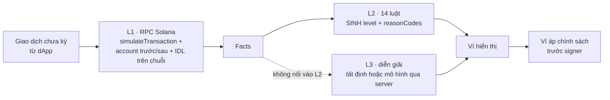

# Gói mentor 1:1 — 28/09/2026

> **Cập nhật 25/09:** track đã rõ — **Best Technical Build**; đội đã vào **chung kết 10/10**. Câu (f-1) và
> phần lịch 02/10/03/10 bên dưới không còn áp dụng. Định dạng chung kết theo thể lệ là **pitch 5 phút + Q&A
> 3 phút + Expo booth** — chưa xác nhận còn áp dụng; nên thay câu (f-1) bằng câu hỏi về định dạng này.

Mục tiêu buổi: **ra quyết định**, không trình diễn. Ba việc cần chốt: track, cách chấm ô 25 % khi không có
smart contract, và format vòng 02/10 hoặc 03/10. Mọi số dưới đây đo ngày 25/09 — nguồn ở
[`FINDINGS.md`](FINDINGS.md).

> ⚠️ **Trước buổi mentor phải push.** Bản GitHub Pages đang chạy mã TRƯỚC khi sửa: mở trang tấn công công
> khai lúc 25/09 cho Transfer 500 000 000, ví không ra Nguy hiểm
> ([bằng chứng](ban-giao-github-pages-TRUOC-PUSH.json)). CI dựng lại Pages khi push `main`.

---

## (a) Demo trực tiếp 60–90 giây

**Host:** GitHub Pages — nơi duy nhất có **cả** ví và trang tấn công (Vercel không có `/tan-cong/`, trả 404).
Trên Pages, diễn giải là **tất định** và giao diện nói đúng như vậy. Nếu muốn trình diễn AI thật, dùng Vercel
cho ví và **nói rõ** đó là host khác — xem mục (f), câu 3.

| Giây | Làm | Nói |
|---|---|---|
| 0–15 | Mở trang tấn công. Chỉ băng đỏ "Trang lừa đảo GIẢ" | "Một trang hứa 1 000 token. Đây là đạo cụ; giao dịch nó dựng là thật, trên Devnet." |
| 15–25 | Bấm **Nhận 1.000 SOLB** → ví mở | "Trang đẩy giao dịch sang ví, đúng cách một dApp thật làm. Nó khai đây là airdrop." |
| 25–55 | Chỉ thẻ kết quả: **Nguy hiểm**, dòng số dư, dòng chủ sở hữu | "Số dư giảm một nửa — có lệnh Transfer thật. Và tài khoản đổi chủ — lệnh SetAuthority. Hai hậu quả, không cái nào là airdrop." |
| 55–75 | Chỉ khối "Trang web nói một đằng, giao dịch làm một nẻo" và "Đã đọc hiểu 2 trên 3 lệnh" | "Custos nói ra phần nó CHƯA đọc được — một lệnh memo. Mức cảnh báo do 14 luật quyết, không do AI." |
| 75–90 | (nếu còn giờ) Ví → bấm **Cấp quyền rút vừa đủ — đối chứng** | "Cùng lệnh Approve, chỉ khác hạn mức: engine im. Không có ca này thì 'bắt đúng' và 'gắn cờ mọi thứ' trông như nhau." |

**Đường lui, theo thứ tự:**

1. Trang tấn công báo *"Hiện trường demo trên Devnet chưa sẵn sàng"* → hiện trường đã hỏng (đổi chủ/cạn tiền).
   Chuyển sang ví, bấm **Tấn công đầy đủ** — cùng giao dịch, dựng trong ví. Sau buổi: `npm run hien-truong`.
2. Báo *"không trả lời / không kết nối được"* → Devnet chậm. Bấm **Thử lại** một lần.
3. Vẫn hỏng → chiếu video dự phòng và **nói là video**:
   `docs/pitch-technical/video-du-phong-2026-09-25/CUSTOS-DEMO-DU-PHONG-2026-09-25.mp4` (16,8 giây, quay
   25/09 trên đúng bản này, không thuyết minh, **chưa commit** — thư mục bị gitignore).

**Lặp lại được:** cổng `python scripts/kiem-trinh-duyet/soi-ban-giao-tan-cong.py` chạy 4 lượt (desktop ×2,
mobile ×2) + 2 ca lỗi. Chạy lại ngay trước buổi trên đúng máy và mạng sẽ dùng.

## (b) Video dự phòng

Có bản 25/09 ở trên — thô, không thuyết minh. Video cũ `docs/nop-bai/video/CUSTOS-DEMO.mp4` hiện `500 → 0`,
**không khớp bản đang chạy** (`490 → 245`) — không dùng nó cho vòng toàn quốc. `[CẦN NGƯỜI]`: quay lại có
thuyết minh sau khi push, trên đúng host sẽ trình bày.

## (c) Kiến trúc một trang

**Phần on-chain Custos dùng** (câu trả lời cho ô 25 % khi không có contract): mô phỏng qua RPC; đọc trạng thái
account trước/sau; đọc IDL **công bố trên chuỗi** để giải mã chương trình (7 chương trình, 245 mã lệnh); Token-2022
extension (2/26 đọc được). **Custos không ghi gì lên chuỗi** — cố ý: lớp đọc thêm contract không đáng tin hơn.

**Fail-safe:** thiếu dữ liệu ⇒ `warning`, không bao giờ `safe`. Mô hình hỏng ⇒ câu tất định. RPC hỏng ⇒ chặn.

**Điều Custos KHÔNG kiểm soát** (`docs/bao-mat/THREAT-MODEL.md`): RPC nói dối; trạng thái đổi giữa mô phỏng và ký;
ví bỏ qua kết quả; chương trình chưa đọc hiểu; người dùng bấm ký bất chấp; bên tích hợp không truyền `nguoiDung`.

## (d) Đã build · đã đo · chưa biết

| Đã build | Đã đo (25/09) | Chưa biết |
|---|---|---|
| SDK đóng gói, cài được từ tarball | 1025 test · 0 đỏ | Tỉ lệ báo nhầm — chưa có ground truth |
| 14 luật L2, 19 mã lý do | 9/9 kịch bản mô phỏng Devnet, 0 lệch | Hiệu quả trên mainnet traffic |
| Ví mẫu + trang tấn công + 9 kịch bản | Tấn công → ví 4/4, desktop + mobile | Có ví nào chịu tích hợp — **0 phỏng vấn người mua** |
| L3 tất định + đường mô hình qua server | Mô hình thật 19/09: trung vị 2 114 ms, 13/13 ca đối kháng chặn | Lợi ích của AI so với câu mẫu — ngang nhau trên thước hiện có |
| Probe trình duyệt + axe | 45/45, 0 vi phạm axe trong phạm vi probe | Người dùng mới có hiểu thẻ **bản hiện tại** không (13/20 đo trên bản cũ) |
| Ví dụ tích hợp ngoài monorepo | Live Devnet 8/8 | Bất kỳ pilot bên thứ ba nào |

Cohort 20 giao dịch: **0 bị cáo buộc**, **7 bị gắn cờ**, **báo nhầm chưa đo được**. Không nói "0 gắn cờ".

## (e) Ba đề xuất nâng cấp — tác động × rủi ro

| # | Việc | Ô rubric | Chi phí | Rủi ro hồi quy | Điều kiện dừng |
|---|---|---|---|---|---|
| 1 | **Ca "lệnh trông vô hại, trạng thái lộ hậu quả"** qua CPI, kèm ca an toàn gần giống — dùng giao dịch Devnet/replay thật, không viết contract riêng | 30 % chiều sâu · 25 % Solana stack | 1–2 ngày | Trung bình — cần fixture ổn định | Không có giao dịch CPI thật trên Devnet ⇒ dùng replay có nhãn, hoặc bỏ |
| 2 | **Hiệu năng đo trên đúng host trình bày**: p50/p95 từ bấm → thẻ, số lượt RPC mỗi lần kiểm, kích thước bundle | 25 % hiệu năng · 20 % demo | nửa ngày | Thấp — chỉ đo | Số đo chỉ lấy trên host thật, không trên localhost |
| 3 | **Trang kiến trúc on-chain/off-chain** trả lời thẳng ô 25 %: vì sao không contract, Custos đọc gì từ chuỗi, ranh giới tin cậy | 25 % kiến trúc | vài giờ | Không | Chờ câu trả lời mentor (f-2) trước khi đầu tư thêm |

**Không làm:** thêm Anchor program chỉ để có "smart contract"; thêm loại tấn công không có ca đối chứng;
đại tu giao diện sát vòng thi.

## (f) Câu hỏi mentor — ưu tiên từ trên xuống

1. **Form chấm của đội đang thuộc track nào?** Nếu chuyển được sang Technical Build: thao tác gì, hạn nào? Vòng
   02/10 hay 03/10 áp dụng cho đội?
2. Với SDK **không có smart contract**, ô 25 % "on-chain/off-chain architecture and smart contract quality" chấm
   thế nào? Bằng chứng nào thuyết phục hơn một contract phụ không có nhu cầu sản phẩm?
3. Vòng toàn quốc có **bắt buộc** AI gọi mô hình trực tiếp trong demo không? Chấp nhận biên bản chạy mô hình thật
   có log + đường lui tất định được gắn nhãn không?
4. Format 02/10 / 03/10: còn 4 phút pitch + 2 phút Q&A như thể lệ không? Video dự phòng, deck, repo/tag, booth
   yêu cầu thế nào?
5. Giám khảo vòng trường khen/chê gì cụ thể? (xin nguyên văn)

Ghi câu trả lời **nguyên văn kèm người nói**. Lời mentor không phải quyết định của BTC — đừng ghi "BTC đã duyệt"
nếu người nói là mentor.
