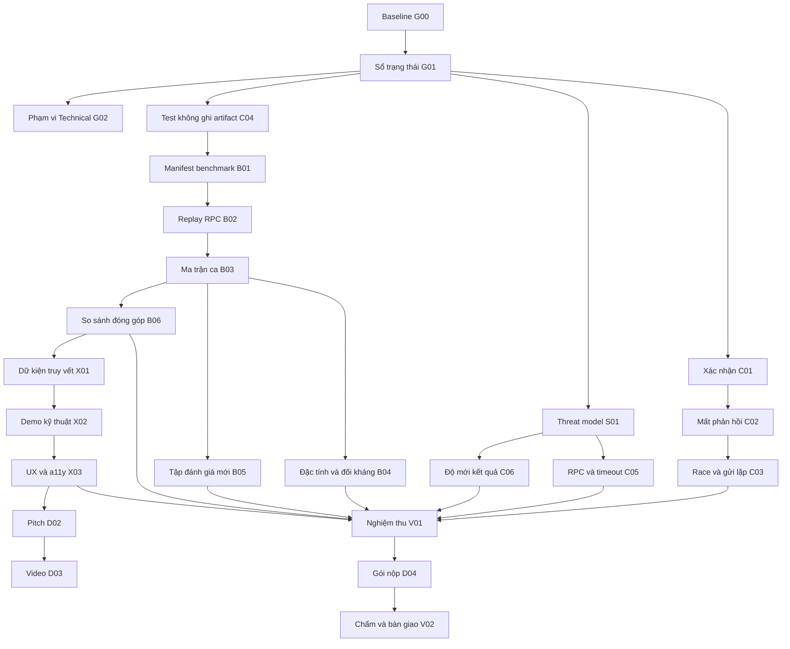

# Roadmap phát triển Custos — Best Technical Build

**Phiên bản kế hoạch:** 1.0 · soạn 12/09/2026. **Cách thực hiện:** theo phụ thuộc và điều kiện nghiệm thu, không theo ngày/tuần/sprint. Ngày trong tài liệu chỉ nhận diện nguồn bằng chứng, không phải hạn hoàn thành.

**Mục tiêu:** hoàn thiện Custos thành một transaction-intelligence SDK có tính đúng được kiểm chứng, tích hợp được ngoài repo, giải thích được từng cảnh báo và trình diễn được giá trị kỹ thuật riêng trên Solana.

**Trạng thái của tài liệu:** kế hoạch thực thi, chưa phải báo cáo đã triển khai. Các thẻ bên dưới mặc định `TODO`; số liệu baseline là kết quả review trước khi làm roadmap này.

**Cách đọc:** mục 1–6 xác định phạm vi và cách vận hành; mục 7–15 chứa các thẻ bắt buộc và nhánh AI tùy chọn; mục 16–17 là ma trận/lệnh nghiệm thu; mục 18–19 là đầu vào bên ngoài và mở rộng; mục 20–21 dùng để tiếp tục qua nhiều phiên. Tổng cộng **40 thẻ: 34 bắt buộc, 4 có điều kiện (L02, O01–O03), 2 cần đầu vào/hành động bên ngoài (H01–H02)**.

## 1. Quyết định phạm vi

### 1.1. Điều đã biết và giả định làm việc

- Chủ dự án yêu cầu tiếp tục phát triển sau roadmap cũ; hiện nhóm không có khả năng bổ sung khảo sát thị trường, buyer interview hoặc phỏng vấn người dùng mới.
- Theo thông tin chủ dự án cung cấp, BTC cho phép đổi track. Kế hoạch này chuẩn bị sản phẩm và hồ sơ theo **Best Technical Build**. Việc đã cho phép đổi không đồng nghĩa biểu mẫu đăng ký đã được cập nhật.
- Chủ đề trong repo hiện là **AI × Web3**. Không tự suy ra rằng chủ đề cũng đã đổi. Dữ liệu AI được giữ trung thực, kể cả khi không chứng minh được ưu thế của mô hình.
- Baseline review là commit `780cf6d5408c031a852ac1fec371bbc5c9dc3207`. Nếu HEAD đã đổi, kiểm lại hiện trạng; không chép kết luận cũ thành kết quả của bản mới.
- Custos tiếp tục là SDK đọc/mô phỏng. Bản bắt buộc không phát triển smart contract, staking registry, token riêng, backend thương mại hay mainnet runtime.
- Phần kỹ thuật offline có thể làm và nghiệm thu riêng bằng fixture có nguồn gốc, kiểm thử đối kháng, benchmark và consumer tự dựng. Bản ứng viên của Custos trong kế hoạch này vẫn phải có demo mô phỏng thật Devnet ở B07; chỉ offline thì V01 kết luận PARTIAL. Đây là phụ thuộc hạ tầng, không phải yêu cầu tìm người phỏng vấn/đối tác. Bằng chứng tự dựng không được ghi thành xác nhận từ bên ngoài.

### 1.2. Kết quả cuối phải có

1. Luồng kiểm tra/ký/gửi không báo quá những gì hệ thống biết, kể cả khi mạng hoặc xác nhận lỗi.
2. Bộ kiểm có thể tái lập trên đầu vào cố định, phân biệt lỗi sản phẩm với thiếu dữ liệu hoặc môi trường không hỗ trợ.
3. Bảng so sánh chứng minh phần đóng góp của Custos so với các cách đọc giao dịch đơn giản hơn.
4. Mỗi cảnh báo trong demo kỹ thuật truy được tới dữ kiện và quy tắc đã tạo ra nó.
5. SDK đóng gói có consumer ngoài repo; trình duyệt và Node được kiểm theo phạm vi hỗ trợ đã công bố.
6. Hồ sơ Technical nhất quán với code, artifact và mức hoàn thiện thật; có video dự phòng.
7. Một sổ trạng thái đủ để Claude ở phiên mới tiếp tục mà không cần hỏi lại lịch sử.

### 1.3. Những việc không còn là điều kiện nghiệm thu Technical

Buyer interview, usability vòng 2, partner pilot, TAM/SAM/SOM và xác nhận willingness-to-pay được chuyển sang **hoãn theo phạm vi**, giữ nguyên những bằng chứng cũ nếu có. Không xóa lịch sử; không đánh dấu chúng là đã hoàn thành. Tài liệu vẫn phải giải thích người tích hợp dự kiến là ví/dApp và Custos giải quyết vấn đề gì.

### 1.4. Nguồn phải đọc

| Nguồn hiện có | Dùng để |
|---|---|
| [CLAUDE.md](CLAUDE.md), [docs/CUSTOS.md](docs/CUSTOS.md) | Quy tắc repo và quyết định sản phẩm; kiểm tra phần trạng thái đã cũ |
| [Đặc tả Core](docs/DAC-TA-CORE.md), [đặc tả L3](docs/DAC-TA-L3.md) | Hợp đồng dữ liệu, ranh giới trách nhiệm |
| [Review Technical 12/09](docs/review/DANH-GIA-TECHNICAL-12-09-2026.md) | T01–T04, baseline, giới hạn kết luận |
| [Roadmap trước](docs/roadmap/ROADMAP-CLAUDE.md), [tiến độ](docs/roadmap/TIEN-DO.md), [bàn giao](docs/roadmap/BAN-GIAO.md) | Kế thừa việc đã làm; không thực hiện lại chỉ vì đổi track |
| [Benchmark](docs/BENCHMARK.md), [seed dataset](docs/SEED-DATASET.md) | Corpus, provenance, hạn chế ground truth |
| [Hiệu năng](docs/HIEU-NANG.md), [phụ thuộc](docs/PHU-THUOC.md) | Phép đo cũ và rủi ro chưa loại bỏ |
| [Decoder tiếp theo](docs/DECODER-TIEP-THEO.md) | Đường IDL đã có, tránh đề xuất lại thứ đã làm |
| [Thể lệ](docs/cuoc-thi/Thể%20lệ%20UniHackfest%202026.md) | Rubric thực tế của track |
| [Thông tin vòng hiện tại](docs/cuoc-thi/THONG-TIN-VONG-HIEN-TAI.md) | Nguồn duy nhất về lịch và yêu cầu BTC |

Các đường dẫn ghi **tạo mới** bên dưới là đầu ra cần làm, chưa phải file/lệnh đã tồn tại. Nếu repo đã có đầu ra tương đương, mở rộng nó và ghi mapping trong sổ tiến độ thay vì dựng hệ thống trùng lặp.

## 2. Các vai và cách phối hợp

Đây là các trách nhiệm phản biện, không đòi hỏi có bảy người hay bảy agent. Một Claude có thể lần lượt đảm nhiệm.

| Vai | Trách nhiệm | Câu hỏi phải trả lời |
|---|---|---|
| Lead | Phạm vi, phụ thuộc, sổ trạng thái | Việc nào làm được tiếp ngay? Điều gì thực sự chặn? |
| Solana | L1/L2, transaction, account, RPC | Kết luận có đúng với semantics của Solana không? |
| Security | Ranh giới tin cậy, đầu vào đối kháng | Kẻ gửi dữ liệu sai có thể làm hệ thống trấn an quá mức không? |
| QA | Tái hiện, oracle, hồi quy, khả năng tái lập | Test có thể bắt lỗi thật hay chỉ xác nhận implementation của chính nó? |
| UX | Luồng quyết định và khả năng tiếp cận | Người dùng thấy gì, hiểu gì và làm được gì ở mỗi trạng thái? |
| SDK/Perf | Consumer, compatibility, latency, chi phí RPC | Bên tích hợp có chạy được và biết giới hạn không? |
| Judge/Docs | Rubric, claim, demo, phản biện | Có thể chứng minh từng phát biểu ngay trước giám khảo không? |

Người thực thi tự phối hợp các vai trong phạm vi được giao; không dừng xin xác nhận mỗi lần phải sửa file của một vai khác. Nếu dùng nhiều agent, chỉ phân việc độc lập, chỉ định người giữ từng file và có bước tích hợp cuối. Không coi nhiều lời tự chấm là đánh giá độc lập từ bên ngoài.

## 3. Prompt khởi động dành cho Claude

Chủ dự án có thể gửi nguyên đoạn sau khi muốn **bắt đầu triển khai**, thay vì chỉ đọc kế hoạch:

```text
Hãy thực hiện docs/roadmap/ROADMAP-TECHNICAL-CUSTOS.md cho Custos.
Bạn phối hợp các vai Lead, Solana, Security, QA, UX, SDK/Perf và Judge/Docs.
Đọc CLAUDE.md, nguồn sản phẩm và sổ tiến độ; bắt đầu từ G00 rồi làm các thẻ
bắt buộc theo phụ thuộc. Tôi giao phạm vi sửa code nội bộ, UI, test, script,
tài liệu và tạo artifact cục bộ cần thiết để hoàn thành roadmap.

Giữ hợp đồng inspect() hiện có và các bất biến bảo mật. Với trace, ưu tiên
diagnostic nội bộ hoặc entrypoint riêng; không tự đổi ý nghĩa public API.
Các bổ sung API chỉ được triển khai nếu tương thích ngược, đã có ADR và
consumer kiểm chứng; thay đổi phá vỡ hợp đồng phải được nêu thành quyết định riêng.

Nhóm không thể làm thêm phỏng vấn hoặc nghiên cứu thị trường. Không đưa chúng
thành điều kiện hoàn tất phần kỹ thuật và không tạo dữ liệu thay thế giả.
Không gắn timeline. Không tăng scope chỉ để có thêm công nghệ hoặc thêm test.

Tự tiến hành các việc cục bộ đã được giao, tiếp tục việc độc lập khi một nhánh
thiếu đầu vào. Chưa có quyền thì chuẩn bị bản có thể review trước khi hỏi về
push/publish/deploy, liên hệ BTC/đối tác, chi phí API hoặc hành động ghi lên chain.
Tôn trọng quyền đã được cấp trong phiên; không hỏi lại cùng một việc.

Mỗi thẻ có tái hiện hoặc baseline, thay đổi, kiểm tra phù hợp và artifact.
Không tick DONE nếu chỉ có kế hoạch hoặc đã chạy lệnh nhưng chưa đọc kết quả.
Cuối phiên cập nhật docs/roadmap/TIEN-DO.md và docs/roadmap/BAN-GIAO.md.
Phân biệt kỹ thuật đã nghiệm thu, hồ sơ sẵn sàng và phát hành thực tế.
```

Tài liệu không tự cấp quyền thực hiện hành động bên ngoài. Quyền trong phiên làm việc và chỉ dẫn cấp cao hơn tiếp tục có hiệu lực. Tạo file roadmap không đồng nghĩa đã bắt đầu triển khai các thẻ.

## 4. Bất biến và ranh giới thiết kế

1. **L2 sở hữu `level`.** AI không sửa mức, không xác nhận an toàn và không phủ định cảnh báo của engine.
2. `expectedAction`, token symbol, memo, IDL và chuỗi từ dApp là dữ liệu không đáng tin. Khớp lời khai không được hạ cảnh báo.
3. Phân biệt **người được bảo vệ**, người trả phí, người ký và chủ của account/token account. Không lấy fee payer làm người dùng khi dữ kiện nói khác.
4. Thiếu dữ liệu cần thiết cho kết luận không được hiểu thành không có rủi ro. Đọc kỹ ngoại lệ hiện có: thiếu dữ liệu làm giàu không tự nâng mức; coverage khuyết ở lệnh không liên quan tài sản không tự động đồng nghĩa nguy hiểm. Mọi sửa đổi phải giữ semantics đã được chứng minh, không thêm luật “không biết gì cũng đỏ”.
5. Coverage đo phạm vi đọc hiểu, không đo accuracy hoặc mức an toàn. Nhận diện tên instruction bằng IDL chưa đồng nghĩa đã kiểm chứng semantics hay độ an toàn của program.
6. Không nhầm số dư bằng không, account đã đóng, account không trả về và mô phỏng hỏng. Không suy ra mất tài sản từ dữ liệu không đo được.
7. `inspect()` chỉ đọc/mô phỏng. Chính ví/consumer thực thi chính sách có cho ký hay không; SDK không thể ngăn một consumer cố ý bỏ qua kết quả.
8. Demo công khai không nhúng khóa ký/API; hành vi ký thật chỉ thuộc môi trường được cấp quyền. Không chuyển demo sang mainnet để tăng tính thuyết phục.
9. Một kết quả mô phỏng là quan sát tại trạng thái chuỗi khi đọc. Không hứa rằng nó bảo đảm trạng thái thực thi sau đó giống hệt. Thay transaction, blockhash hoặc người dùng phải có quy tắc làm mất hiệu lực kết quả cũ.
10. Giữ tương thích `InspectResult`, `InspectOptions`, import/subpath đang công bố. Không thay đổi kiểu public hoặc đổi tên hàng loạt chỉ để dễ viết tính năng mới.
11. Token-2022, ALT, delegate và CPI có trường hợp hợp lệ. Phải có ca đối chứng; không coi sự tồn tại của tính năng là tấn công.
12. Không thêm on-chain program trong phần bắt buộc. Nếu phạm vi sau này thay đổi, cần quyết định sản phẩm riêng; không lén đưa vào thông qua một thẻ demo/test.

## 5. Điểm xuất phát và thứ tự ưu tiên

### 5.1. Baseline đã quan sát, cần xác minh khi bắt đầu

| Hạng mục | Baseline review 12/09 | Phạm vi |
|---|---|---|
| Typecheck/unit test | 487/487 đạt | Không tương đương accuracy |
| Tích hợp tất định | 14/14 đạt | RPC stub, không gửi thật |
| Browser | 40/40 đạt | Chromium, viewport giả lập |
| Mobile | Kết quả/focus đạt 320/375/768 px | Không xác nhận thiết bị thật |
| Build | Hai app thành công | Không đồng nghĩa đã deploy bản mới |
| SDK consumer ngoài repo | JS/TS đạt; 10 bẫy + 3 đối chứng đạt | Consumer do đội dựng |
| Dependency | 5 high + 6 moderate | Advisory chưa được loại bỏ |
| AI | Chưa chứng minh giá trị vượt template trên phép đo hiện có | Không kết luận AI luôn kém |
| Technical score | Tạm chấm khoảng 7,4/10 | Không là điểm BTC, không là xác suất đạt giải |

Các probe gốc nằm trong `.thu-pages/audit-2026-09-12/`, thư mục bị Git bỏ qua. G00 phải lưu bản tái hiện tối thiểu có thể mang sang máy khác; không để khả năng xác minh phụ thuộc đường dẫn cá nhân.

### 5.2. Các mức ưu tiên

- **P0:** phát hiện mới làm lộ khóa, gửi sai transaction hoặc cho ký trái chính sách. Dừng nhánh bị ảnh hưởng, tái hiện và sửa trước. Không gán P0 cho một giả thuyết chưa kiểm.
- **P1:** tính đúng của trạng thái, ranh giới tin cậy, dữ liệu đo và luồng demo chính.
- **P2:** độ tái lập, composability, UX, hiệu năng, tài liệu và khả năng thuyết trình.
- **Mở rộng có điều kiện:** chỉ làm khi có tác dụng đo được và phần bắt buộc đủ ổn định.

### 5.3. Sơ đồ phụ thuộc tổng quát



Sơ đồ thể hiện các nhánh chính; trường **Phụ thuộc** của từng thẻ bên dưới là nguồn đầy đủ, bao gồm security, performance, AI và SDK. Các thẻ cùng mức sẵn sàng có thể thực hiện độc lập nếu không sửa chung file.

## 6. Quy tắc trạng thái, bằng chứng và hoàn thành

### 6.1. Một sổ trạng thái duy nhất

Tiếp tục dùng `docs/roadmap/TIEN-DO.md`, thêm mục **Roadmap Technical** với ID có tiền tố `TB-` để tránh trùng R/U/A/B/P/V của roadmap trước. Tiêu đề thẻ trong tài liệu này đã dùng ID đầy đủ. Trong phần mô tả, ID ngắn như C01 chỉ đúng thẻ TB-C01.

| Trạng thái | Ý nghĩa |
|---|---|
| TODO | Chưa bắt đầu |
| DOING | Đang thực hiện; có bước tiếp theo cụ thể |
| VERIFY | Đã sửa, còn kiểm cần chạy |
| DONE | Đạt mọi điều kiện của chính thẻ, có artifact tương ứng |
| WAIT_INPUT | Cần dữ kiện/quyền/tài nguyên ngoài phạm vi; ghi chính xác phần thiếu |
| BLOCKED_TECH | Có vấn đề kỹ thuật chặn; ghi tái hiện và hướng đang điều tra |
| DEFERRED_SCOPE | Hoãn theo phạm vi đã quyết định; không tính là DONE |

Một thẻ bắt buộc WAIT_INPUT/BLOCKED_TECH không được tự biến thành tùy chọn để làm xanh tổng thể. Có thể đóng phần độc lập thành subtask và ghi **nghiệm thu một phần**. V02 là báo cáo kết quả, có thể hoàn thành với kết luận “chưa sẵn sàng”; điều đó không làm V01 hoặc sản phẩm tự đạt.

### 6.2. Definition of Done của một thẻ kỹ thuật

1. Xác minh vấn đề còn tồn tại ở bản đang sửa, hoặc xác định phép đo baseline cho nâng cấp.
2. Thay đổi nhỏ nhất đáp ứng mục tiêu, không để TODO quan trọng nằm trong đường người dùng.
3. Test có khả năng thất bại khi lỗi hiện diện; bản sửa làm nó đạt. Với thay đổi văn bản đơn giản, kiểm link/nội dung phù hợp là đủ.
4. Chạy các kiểm liên quan; không dùng số test làm mục tiêu và không viết test chỉ dò chuỗi mã triển khai.
5. Ghi hạn chế/phạm vi chưa kiểm. Không lấy stub thành bằng chứng live.
6. Kiểm tương thích và ranh giới tin cậy nếu thẻ chạm public surface.
7. Cập nhật trạng thái, file thay đổi, artifact, người/vai review và việc kế tiếp.

### 6.3. Quy cách artifact

Mỗi lượt đo quan trọng có `runId`, `sourceCommit`, dấu vết nội dung liên quan khi working tree bẩn, phiên bản tool, môi trường, dataset hash, cấu hình, lệnh, exit code, kết quả đầy đủ và ca không chạy được. Không lưu secrets, URL RPC có credential, dữ liệu phỏng vấn riêng tư hoặc khóa demo.

- **Đề xuất thư mục tạo mới:** `docs/review/technical/<runId>/` cho báo cáo/log đã lọc; `data/technical/<suite>/<runId>/` cho dữ liệu máy đọc khi cần.
- File lớn có manifest và cơ chế lấy lại đã kiểm; không commit đống `node_modules`, cache hay build tạm.
- Snapshot lịch sử được giữ bất biến. Con trỏ `latest` chỉ trỏ tới lượt đã hoàn tất; lượt hỏng không được mất khỏi lịch sử.
- Hash/commit chứng minh nguồn gốc và khả năng đối chiếu, không chứng minh kết luận đúng hay dữ liệu độc lập.
- Việc thêm báo cáo/ghi trạng thái không tự làm vô hiệu mọi benchmark: xác định tập file ảnh hưởng, giữ chính sách tương đương nội dung có giải thích.

## 7. Thiết lập nền và chuyển hướng

### TB-G00 — Xác minh baseline và giữ bằng chứng gốc

**Vai:** Lead, QA. **Ưu tiên:** P1. **Phụ thuộc:** không. **Loại:** bắt buộc.

**Đọc/sửa:** nguồn ở mục 1.4, `package.json`, scripts gọi bởi kiểm thử; chỉ tạo snapshot và báo cáo, chưa sửa logic.

**Các bước:**
1. Ghi HEAD, diff ban đầu, Node/npm, hệ điều hành; kiểm AGENTS/CLAUDE hiện hành. Không đọc/in giá trị secret.
2. Xác minh T01–T04 từ review còn đúng; đưa probe tối thiểu vào artifact có thể lưu theo Git. Nếu đã sửa, kiểm lại và ghi commit chứa bản sửa.
3. Sao lưu/hash artifact có khả năng bị script ghi trước khi chạy `npm run check`, đặc biệt `data/eval/ai-ket-qua.json`.
4. Chạy baseline offline, build hai app; browser/live dùng môi trường sẵn có khi truy cập được. Nếu chỉ kiểm offline thì ghi đúng phạm vi và tiếp tục C04.
5. Kiểm diff sau lệnh. Chỉ hoàn nguyên thay đổi do chính lượt kiểm gây ra và đã xác định; giữ mọi sửa đổi có trước của chủ dự án.

**Đạt khi:** có snapshot đủ tái lập T01/T02/T03 hoặc bằng chứng chúng đã được sửa; biết chính xác phần nào chưa kiểm. Không bắt buộc mọi baseline phải xanh mới được sửa lỗi.

### TB-G01 — Đưa roadmap mới vào sổ thực thi

**Vai:** Lead. **Ưu tiên:** P1. **Phụ thuộc:** G00. **Loại:** bắt buộc.

**Đọc/sửa:** `docs/roadmap/TIEN-DO.md`, `docs/roadmap/BAN-GIAO.md`, phần tài liệu trong `CLAUDE.md`.

**Các bước:** thêm các ID TB- vào sổ chung; lưu lịch sử roadmap cũ; ghi lỗi T01–T04 là vấn đề mới cần theo dõi. Các ô H01–H03/B03 cũ liên quan người thật chuyển DEFERRED_SCOPE theo giới hạn người dùng; không xóa dữ liệu đã có. A02 cũ có eval mới, không đặt lại “chưa có khóa”. Đổi câu “không còn việc nào Claude tự làm được” thành danh sách việc sẵn sàng thực tế.

**Đạt khi:** phiên mới đọc hai file bàn giao xác định được thẻ tiếp theo và lý do; không có hai bảng cùng tự nhận là nguồn trạng thái hiện tại. Roadmap cũ có chỉ dẫn chuyển tiếp nhưng còn đọc được lịch sử.

### TB-G02 — Chốt cách kể sản phẩm theo rubric Technical

**Vai:** Lead, Judge/Docs. **Ưu tiên:** P2. **Phụ thuộc:** G01. **Loại:** bắt buộc.

**Đọc/sửa:** `README.md`, `CLAUDE.md`, tài liệu pitch, `docs/cuoc-thi/`; tạo ADR phạm vi trong thư mục tài liệu phù hợp nếu chưa có.

**Các bước:** ghi bảng 30/25/25/20 đúng rubric; viết một mô tả thống nhất về SDK, người tích hợp, điểm khó và giới hạn. Chuẩn bị metadata Technical và kiểm các vị trí ghi track; phân biệt hướng phát triển được giao với đăng ký BTC đã cập nhật. Lưu câu hỏi về cách chấm SDK không contract vào H01, không để chặn code. Giữ chủ đề hiện tại cho tới khi có quyết định đổi riêng.

**Đạt khi:** có câu chuyện kỹ thuật rõ, không hứa tỷ lệ phát hiện, không tự nâng điểm cũ, không đòi thị trường/phỏng vấn mới. Phần chuẩn bị cục bộ có thể DONE khi trạng thái đăng ký bên ngoài còn mở và được ghi rõ.

## 8. Sửa tính đúng và vòng đời giao dịch

### TB-C01 — Phân loại đúng kết quả xác nhận [T01]

**Vai:** Solana, QA, UX. **Ưu tiên:** P1. **Phụ thuộc:** G01. **Loại:** bắt buộc.

**Đọc/sửa:** `apps/demo-wallet/src/gui.ts`, `apps/demo-wallet/src/App.tsx`, `apps/demo-wallet/test/gui.test.ts`, source của phiên bản `@solana/web3.js` đã cài.

**Các bước:**
1. Tái hiện Promise resolve với `value.err` khác null vẫn thành `thanhCong`.
2. Dùng kiểu response thực tế thay `Promise<unknown>` ở ranh giới cần đọc; validator bảo vệ dữ liệu runtime nếu interface được mock/đi qua transport tùy biến.
3. Chỉ chuyển thành công khi trạng thái xác nhận đủ điều kiện và `err === null`.
4. Thêm trạng thái thực thi thất bại đã xác nhận, giữ chữ ký và lỗi; không dùng lại copy “chưa gửi, chưa có gì thay đổi”. Một giao dịch thực thi thất bại vẫn có thể chịu phí.
5. Response sai cấu trúc, thiếu `value` hoặc không xác định được kết quả phải là chưa rõ/lỗi kiểm tra; không phải thành công.
6. UI phân biệt thành công, thất bại thực thi, lỗi trước gửi và chưa rõ. Không xóa dữ liệu cần tra cứu ở nhánh thất bại/chưa rõ.

**Nghiệm thu:** test `err:null`, `InstructionError`, response thiếu trường, RPC reject, timeout; kiểm qua component bằng transport giả. Chỉ thêm `throw` vào catch cũ rồi ra `chuaRo` chưa đáp ứng thẻ này.

**Nguồn giao thức:** [signatureSubscribe](https://solana.com/docs/rpc/websocket/signaturesubscribe) trả thông báo cuối có trường lỗi; phải đọc nội dung xác nhận, không chỉ trạng thái Promise.

### TB-C02 — Giữ chữ ký và xử lý mất phản hồi gửi [T02]

**Vai:** Solana, Security, QA. **Ưu tiên:** P1. **Phụ thuộc:** C01. **Loại:** bắt buộc.

**Đọc/sửa:** cùng đường gửi C01; helper nội bộ lấy chữ ký nếu cần, không đưa khóa vào log.

**Các bước:**
1. Sau khi ký hợp lệ, lấy chữ ký transaction trước bước gửi; không chờ RPC trả mới có ID để tra cứu. Dùng chữ ký đầu tiên của transaction theo giao thức, không nhầm với chữ ký của ví đang thao tác nếu fee payer khác. Giao dịch còn thiếu chữ ký bắt buộc phải đi nhánh chưa sẵn sàng gửi, không lấy mảng toàn số 0 làm transaction ID.
2. Phân biệt lỗi ký/trước network, từ chối có bằng chứng, và lỗi transport sau khi bắt đầu gửi. Trạng thái từ chối chỉ đủ chắc nếu không có lần gửi trước cùng attempt đang không rõ.
3. Khi phản hồi bị mất, giữ signed bytes/chữ ký trong phạm vi riêng của attempt, hiển thị chưa rõ, cho tra trạng thái có timeout.
4. Không tự xây lại transaction/blockhash và ký lại trong nhánh chưa rõ. Gửi lại cùng signed transaction khác với tạo giao dịch mới; không đồng nhất mọi retry thành nguy cơ thực thi hai lần.
5. Chỉ mở luồng tạo yêu cầu mới khi người dùng thực hiện hành động mới theo chính sách rõ hoặc kết quả attempt cũ đã đủ căn cứ; không để nút “Thử lại” ngầm tạo chữ ký mới.

**Nghiệm thu:** stub nhận request rồi cắt phản hồi; lỗi trước ký; từ chối preflight rõ; phản hồi đến muộn; tra trạng thái thành công/thất bại/null/timeout. UI không nói “chưa gửi” khi chỉ biết “chưa nhận phản hồi”.

**Nguồn:** [sendTransaction](https://solana.com/docs/rpc/http/sendtransaction) mô tả chữ ký có sẵn trước khi gửi; RPC chấp nhận không bảo đảm đã thực thi. Giữ đúng phân biệt này trong code và copy.

### TB-C03 — Chống race, kết quả cũ và gửi lặp do giao diện

**Vai:** QA, UX, Solana. **Ưu tiên:** P1. **Phụ thuộc:** C02. **Loại:** bắt buộc.

**Đọc/sửa:** `App.tsx`, luồng handoff, validator yêu cầu ngoài và test browser có liên quan.

**Các bước:** tạo ID cho request/attempt; gắn kết quả inspect, transaction chờ, người dùng và trạng thái gửi vào cùng ID. Khóa thao tác gửi ngay khi handler nhận việc, không chỉ dựa vào render sau `setState`. Bỏ qua completion của request đã bị thay thế/hủy. Đổi scenario, tài khoản hoặc payload không được giữ kết quả cũ có thể dùng để ký.

**Nghiệm thu:** bấm đúp trong cùng lượt sự kiện; request A chậm về sau B; hủy khi đang kiểm; chuyển kịch bản khi đang gửi; hai tab độc lập; React StrictMode. Mỗi attempt hợp lệ có tối đa một lần bắt đầu gửi ở consumer demo. Không tuyên bố bảo đảm exactly-once trên toàn mạng.

### TB-C04 — Test không tự chạy eval hoặc ghi bằng chứng [T03]

**Vai:** QA, Lead. **Ưu tiên:** P1. **Phụ thuộc:** G01. **Loại:** bắt buộc, nên làm sớm trước nhiều lần test.

**Đọc/sửa:** `packages/core/test/soChoPhep.test.ts`, `scripts/eval-ai.ts`, helper của eval.

**Các bước:** tách `soChoPhep`/`soLa` sang module thuần hoặc bảo vệ entrypoint được kiểm trên runtime repo. Import helper không chạy `main`, không gọi API, không ghi artifact. Lệnh CLI chủ động vẫn chạy eval và giữ lịch sử live. Cho phép output tới thư mục tạm khi kiểm chính CLI; không dùng file canonical làm output của test.

**Nghiệm thu:** hash artifact trước/sau `npm run check` không đổi; kiểm import không có file/network side effect; eval offline với output tạm vẫn ra báo cáo; không chỉ sửa timestamp sau mỗi lần test để che lỗi.

### TB-C05 — Ngân sách RPC, hủy chờ và lỗi có cấu trúc

**Vai:** SDK/Perf, Solana, QA. **Ưu tiên:** P1. **Phụ thuộc:** S01, C04. **Loại:** bắt buộc.

**Đọc/sửa:** `scripts/coHan.ts`, `packages/core/src/l1/fetch.ts`, `packages/core/src/inspect.ts`, shim/consumer tích hợp hiện có và `coHan.test.ts`.

**Các bước:** kiểm các deadline hiện có trước khi thêm; lập bảng từng chặng blockhash/ALT/account/simulation/enrichment/L3. Có ngân sách tổng cho consumer, phân biệt deadline với lỗi dữ liệu và user cancel. Retry chỉ với lỗi tạm thời, có giới hạn tổng, không nhân retry ở cả SDK và wrapper. Dữ liệu làm giàu thất bại có đường lui riêng.

Hủy promise chờ không tự hủy request mạng. Khi transport hỗ trợ AbortSignal thì truyền xuống; nơi không hỗ trợ phải bỏ qua kết quả muộn, dọn listener/timer, ghi giới hạn. Ưu tiên wrapper/adapter tương thích API hiện tại; thay public options phải có ADR và consumer test.

**Nghiệm thu:** RPC không bao giờ trả, 429, 5xx, JSON sai, cancellation, hết ngân sách trước chặng tiếp; timer/subscription không tích lũy. Đo hành vi consumer trong thời hạn cấu hình với sai số scheduler đã ghi, không lấy mạng công cộng làm test tất định.

### TB-C06 — Ràng buộc kết quả với transaction và trạng thái quan sát

**Vai:** Solana, Security, QA. **Ưu tiên:** P1. **Phụ thuộc:** S01, C03. **Loại:** bắt buộc.

**Đọc/sửa:** đường dựng transaction, `l1/fetch.ts`, state consumer; tạo ADR về freshness/consistency.

**Các bước:**
1. Ghi dấu vết message bytes, người được bảo vệ, cluster, cấu hình inspection và attempt trong metadata nội bộ. Không dùng chữ ký chưa có để nhận diện một transaction chưa ký.
2. Trước ký, xác minh message vẫn là message đã kiểm. Thay blockhash cũng thay message: re-inspect hoặc quy tắc chuẩn hóa có chứng minh; mặc định re-inspect.
3. Kiểm blockhash hết hiệu lực/đợi quá lâu/đổi account; làm mất hiệu lực kết quả và yêu cầu kiểm lại. Mức freshness cấu hình là quyết định được ghi, không quảng bá thành bảo đảm trạng thái chuỗi bất biến.
4. Kiểm consistency giữa đọc account trước và simulation sau: ghi commitment, context slot khi API hỗ trợ; xử lý dữ liệu thiếu/stale. Nếu API hiện tại làm mất slot, cân nhắc biến thể có context tại adapter.
5. Ghi rõ không có atomic snapshot xuyên nhiều RPC. `minContextSlot` là ràng buộc slot tối thiểu, không khóa hai lượt đọc vào cùng trạng thái. Không sửa chênh lệch bằng cách ghép dữ liệu từ các lượt/cluster khác nhau.

**Nghiệm thu:** thay message sau inspect bị chặn ở consumer; blockhash hết hạn không gửi với phán quyết cũ; kết quả request cũ không hợp lệ cho request mới; fixture mô phỏng slot/commitment không phù hợp không tạo claim tuyệt đối.

**Nguồn:** [getMultipleAccounts](https://solana.com/docs/rpc/http/getmultipleaccounts) và [simulateTransaction](https://solana.com/docs/rpc/http/simulatetransaction) có cấu hình commitment/context; mô phỏng không phát giao dịch và không đóng băng trạng thái tới khi ký.

## 9. Bảo mật và chất lượng dữ liệu

### TB-S01 — Threat model và ranh giới cưỡng chế

**Vai:** Security, Solana. **Ưu tiên:** P1. **Phụ thuộc:** G01. **Loại:** bắt buộc.

**Đọc/sửa:** audit bảo mật hiện có, `facts.ts`, `inspect.ts`, `l2/evaluate.ts`, `l1/coverage.ts`; bổ sung threat model hiện hành.

**Các bước:** liệt kê tài sản cần bảo vệ, tác nhân, trust boundaries và giả định RPC. Theo dõi dApp gian, RPC sai/thiếu dữ liệu, program chưa biết, IDL giả/lỗi, metadata ra lệnh, AI sai, consumer bỏ qua policy. Xác định lớp nào thực thi “chặn ký”; liệt kê phạm vi Custos không kiểm soát.

**Nghiệm thu:** mỗi rủi ro có cơ chế, ca kiểm hoặc giới hạn công khai; phân biệt decode cấu trúc, program xác minh, dữ liệu đo được và khả năng kết luận. Không biến type TypeScript thành chứng minh dữ liệu runtime an toàn.

### TB-S02 — Đầu vào sai, giới hạn tài nguyên và dữ liệu lớn

**Vai:** Security, QA. **Ưu tiên:** P1. **Phụ thuộc:** S01, C04. **Loại:** bắt buộc.

**Đọc/sửa:** validator URL/scene, `l1/parse.ts`, `l1/decode.ts`, `l1/bang-idl.ts`, `facts-io.ts`, bộ lọc metadata.

**Các bước:** kiểm base64 hỏng/quá dài, message malformed, account buffer ngắn/dài, ALT thiếu, inner instruction sai index, IDL bất thường, metadata Unicode/HTML/Bidi, số u64 vượt Number an toàn. Đặt giới hạn kích thước/độ sâu tại nơi nhận dữ liệu; giữ precision bằng bigint/decimal string. Không nối chuỗi lỗi RPC chứa secret lên UI/log công khai.

**Nghiệm thu:** app không trắng trang; lỗi được phân loại, không trở thành `safe`; số tiền không mất precision; không thực thi HTML; input lớn kết thúc trong ngân sách đã chốt. Corpus fuzz có seed và lưu ca thu nhỏ khi lỗi xuất hiện.

### TB-S03 — Xử lý dependency theo đường thực thi thật

**Vai:** Security, SDK/Perf. **Ưu tiên:** P2. **Phụ thuộc:** S01. **Loại:** bắt buộc.

**Đọc/sửa:** `docs/PHU-THUOC.md`, package/lockfile, test phơi nhiễm, SDK dist và bundle app.

**Các bước:** chạy audit mới, nhóm root cause và phân loại runtime browser/Node/build-only. Kiểm phiên bản vá thực tế và mức tương thích trước khi nâng. Nếu không có bản vá phù hợp, giữ phân tích reachability, điều kiện chấp nhận, chủ sở hữu, trigger xem lại; khảo sát cách loại bỏ đường dễ tổn thương nếu cần. Không dùng `audit fix --force` để hạ cấp/phá SDK.

**Nghiệm thu:** mỗi advisory còn lại có quyết định; không bỏ qua advisory chỉ vì ngoài browser nếu gói Node vẫn hỗ trợ đường đó. Thẻ quản trị rủi ro có thể DONE khi hồ sơ đầy đủ, nhưng trạng thái dependency còn rủi ro phải hiện ở V01/V02. Claim “đã vá” chỉ dùng khi dependency bị ảnh hưởng thực sự đã được loại bỏ hoặc nâng đúng bản.

## 10. Benchmark kỹ thuật tái lập

### TB-B01 — Manifest, oracle và phân tầng bằng chứng

**Vai:** QA, Solana. **Ưu tiên:** P1. **Phụ thuộc:** G01, C04. **Loại:** bắt buộc.

**Đọc/sửa:** `docs/SEED-DATASET.md`, `docs/BENCHMARK.md`, `data/seed/`; tạo manifest có version cho benchmark Technical.

**Các bước:** định nghĩa từng mẫu có ID, nguồn, cluster/slot nếu biết, raw tx, trạng thái account/ALT, response RPC hoặc Facts, expected property, nguồn của kỳ vọng, hash, giới hạn và nhãn development/held-out. Phân ba tầng: L2 trên Facts đóng băng; L1→L2 trên RPC replay; runtime thật trên Devnet hoặc VM được kiểm riêng. Giữ provenance của dữ liệu tổng hợp khác dữ liệu chain.

**Nghiệm thu:** runner từ chối mẫu thiếu trường quan trọng và báo mẫu không hỗ trợ; oracle không gọi engine Custos để tự sinh expected verdict. Có thể giữ Facts synthetic để hồi quy, nhưng không ghi nó thành bằng chứng L1 đã giải mã đúng.

### TB-B02 — Replay RPC chạy qua đường L1 sản xuất

**Vai:** Solana, QA. **Ưu tiên:** P1. **Phụ thuộc:** B01. **Loại:** bắt buộc.

**Đọc/sửa:** `l1/fetch.ts`, `facts-io.ts`, test tích hợp/shim; tạo runner/adapter replay nếu chưa có.

**Các bước:** map request theo method và tham số có nghĩa; kiểm account order, encoding, ALT và context. Với request không được ghi trong fixture thì fail rõ, không tự rơi về mạng. Đi qua cùng `extractFacts`/`inspect` sản xuất. Tách capture khỏi replay; capture chỉ chạy khi chủ động và nguồn truy cập được. Lưu raw response trước khi giải mã, loại secret khỏi endpoint.

**Nghiệm thu:** chạy khi network bị chặn vẫn tái lập kết quả chuẩn hóa; đổi dữ liệu account có ý nghĩa làm output tương ứng đổi; thiếu fixture request làm runner báo lỗi. Replay RPC không được mô tả là thực thi SVM mới.

### TB-B03 — Ma trận hành vi Solana có ca đối chứng

**Vai:** Solana, QA, Security. **Ưu tiên:** P1. **Phụ thuộc:** B02, S02. **Loại:** bắt buộc.

**Các bước:** kiểm coverage hiện có trước, chỉ bổ sung phần thiếu trong ma trận mục 16. Mỗi hành vi được claim phải có ca dương và ca hợp lệ gần giống; ưu tiên bằng chứng raw transaction + RPC replay cho L1 thay vì chỉ dựng Facts. Thêm malformed/unsupported khi semantics chưa hỗ trợ.

**Nghiệm thu:** đủ họ hành vi đang quảng bá; ghi rõ Token-2022 extension nào kiểm được/chưa kiểm; v0/ALT/multiple signer không phải nhãn trang trí trong slide. Một ca không hỗ trợ được ghi đúng và đi đường thận trọng, không tự xếp vào pass phát hiện.

### TB-B04 — Kiểm thuộc tính và đối kháng có khả năng phát hiện hồi quy

**Vai:** Security, QA. **Ưu tiên:** P1. **Phụ thuộc:** B03. **Loại:** bắt buộc.

**Các bước:** dùng phép biến đổi chỉ giữ kỳ vọng khi có lý do semantics: đổi symbol không đổi verdict; lời khai khớp không hạ mức; AI hỏng không đổi L2; làm mất account cần thiết không làm kết luận an toàn hơn; nhiều signer cần đúng đối tượng. Không tùy tiện reorder instructions vì thứ tự có thể đổi hành vi. Với fuzz, dùng seed cố định, thu nhỏ ca lỗi và thêm vào bộ hồi quy.

**Nghiệm thu:** ít nhất một mutation tiêu biểu ở từng ranh giới trọng yếu làm bài kiểm liên quan đỏ; ghi kết quả rồi hoàn nguyên mutation. Không đưa mutation vào bản sản phẩm hoặc đặt quota số test để lấy điểm.

### TB-B05 — Tập đánh giá mới và công bố giới hạn thống kê

**Vai:** QA, Judge/Docs. **Ưu tiên:** P2. **Phụ thuộc:** B03. **Loại:** bắt buộc về phương pháp và báo cáo.

**Các bước:** trước tuning thêm, tạo tập mới với expected properties theo đặc tả/nguồn độc lập với verdict, lưu hash và quy tắc chưa dùng để phát triển. Bộ seed 38 mẫu cũ không được đổi tên thành held-out. Có thể do đội tự dựng test kỹ thuật nhưng phải ghi đúng; không gọi independent security validation.

Đánh giá ở bản đã chốt. Sau khi nhìn lỗi rồi chỉnh engine theo tập đó, đánh dấu tập đã dùng để phát triển và tạo tập mới cho lần đánh giá tiếp nếu còn claim held-out. Phân loại TP/FP/TN/FN chỉ khi nhãn và bài toán nhị phân có nghĩa; unknown/unsupported/infra error là nhóm riêng, không bỏ âm thầm.

**Nghiệm thu:** có manifest trước chạy, kết quả trên mọi mẫu, số không đánh giá được và lý do. Nếu chỉ có synthetic properties, báo độ đáp ứng trên tập kiểm này; không công bố accuracy thị trường. Không phụ thuộc phỏng vấn/người ngoài để hoàn thành phép đánh giá kỹ thuật có giới hạn.

### TB-B06 — Đo đóng góp riêng của Custos bằng so sánh thành phần

**Vai:** Solana, QA, Judge/Docs. **Ưu tiên:** P2. **Phụ thuộc:** B03. **Loại:** bắt buộc.

**Các bước:** định nghĩa trước ba baseline có phạm vi rõ: đọc top-level instruction cơ bản; chỉ xem balance delta; pipeline Custos đầy đủ. Chạy cùng dataset, cùng điều kiện RPC, cùng tiêu chí. Chọn ca change authority không đổi số dư, hành vi qua CPI, payload tự khai lành, dữ liệu thiếu và một giao dịch hợp lệ. Lưu cả trường hợp Custos không thêm lợi ích hoặc cảnh báo rộng hơn cần thiết.

**Nghiệm thu:** có bảng từng ca, baseline làm được gì, Custos thêm gì và nguồn dữ kiện; không cố tình làm hỏng baseline để tạo thắng lợi. Đây là so sánh triển khai được mô tả, không phải tuyên bố hơn Phantom/Blockaid hay sản phẩm chưa được test trực tiếp.

### TB-B07 — Kiểm chứng live với phạm vi tối thiểu, an toàn

**Vai:** Solana, QA. **Ưu tiên:** P2. **Phụ thuộc:** B03, C05, C06. **Loại:** bắt buộc cho bản ứng viên Technical có demo Devnet của kế hoạch này.

**Các bước:** dùng hiện trường Devnet đã có để mô phỏng giao dịch chưa ký, không dựng lại/ghi đè nếu không cần. Chạy ca nguy hiểm, lành, khuyết dữ liệu và lỗi RPC có kiểm soát. Ghi cluster, slot nếu có, đầu vào và raw response để replay. Đối chiếu Facts trực tiếp với dữ liệu account và log instruction, không chỉ so màu cảnh báo.

**Nghiệm thu:** ít nhất các ca demo chính có bản ghi live của bản code liên quan; ca RPC lỗi dùng fault injection được ghi nhãn. Không truy mainnet nếu cổng nghiên cứu/nguồn truy cập chưa được cho phép; Devnet đủ cho thẻ này. Nếu live không truy cập được, giữ WAIT_INPUT và tiếp tục toàn bộ nhánh offline; không đổi claim thành “đã live”.

## 11. Làm chiều sâu kỹ thuật nhìn thấy được

### TB-X01 — Trace cảnh báo tới bằng chứng sản xuất

**Vai:** Solana, SDK/Perf, Security. **Ưu tiên:** P2. **Phụ thuộc:** B06, S01. **Loại:** bắt buộc.

**Đọc/sửa:** `l2/rules.ts` (`RuleHit`), `l2/evaluate.ts`, `inspect.ts`, `facts.ts`, `packages/ai/src/mucKyThuat.ts`; ưu tiên thông tin đã có.

**Các bước:**
1. Kiểm code hiện tại đã giữ được những liên kết nào: reasonCode, account, instruction index, CPI parent, dữ kiện trước/sau, điều kiện thiếu.
2. Thiết kế diagnostic schema nội bộ có version: request ID, rule/reason, evidence references, source stage, trạng thái quan sát và giới hạn. Các code/ID ổn định, không dựa vào text tiếng Việt để join.
3. Thu trace cùng lượt tính verdict; không gọi lại RPC rồi ghép trace của trạng thái khác vào cảnh báo cũ. L2 là nguồn kết luận; L3 chỉ định dạng câu.
4. Khi thiếu liên kết, hiển thị “chưa có bằng chứng truy vết chi tiết” thay vì suy diễn instruction gây lỗi từ vị trí trong mảng.
5. Tách raw diagnostics nhạy cảm khỏi phần hiển thị/export mặc định. Không xuất API key, signed transaction hoặc metadata riêng tư ngoài phạm vi cần thiết.
6. Giữ `inspect()` hiện có; dùng entrypoint/wrapper diagnostic tùy chọn nếu cần. ADR ghi vì sao chọn cách đó, impact bundle và compatibility.

**Nghiệm thu:** ít nhất các cảnh báo demo chính đi từ verdict → reason → rule → dữ kiện đo được, đúng cùng request; consumer cũ vẫn chạy; tắt diagnostics không đổi verdict và không tăng RPC. Không cần xây trình debugger tổng quát.

### TB-X02 — Chế độ xem kỹ thuật và ca đối chứng trong demo

**Vai:** UX, Solana, Judge/Docs. **Ưu tiên:** P2. **Phụ thuộc:** X01, C03. **Loại:** bắt buộc.

**Đọc/sửa:** ví demo, trang tấn công, components chi tiết sẵn có, dữ liệu scenario và test browser.

**Các bước:** giữ luồng người dùng mặc định gọn; thêm progressive disclosure để giám khảo xem trace khi cần. Cho chuyển giữa giao dịch nguy hiểm và đối chứng hợp lệ; hiển thị transaction đang kiểm, cluster, kết quả live/replay và phần chưa hiểu. Tránh dàn quá nhiều con số không trả lời một quyết định cụ thể.

Ở chế độ so sánh B06, nhãn baseline phải đúng phạm vi; không đặt màu “an toàn” lên baseline chỉ vì nó không có detector. Chuyển scenario không được giữ trace/summary của scenario trước. Mobile vẫn có hành động hủy dễ tiếp cận, có thể rút gọn đoạn giải thích hoặc bố trí lại action.

**Nghiệm thu:** từ mở demo → chạy ca chính → xem bằng chứng → xem đối chứng → mô phỏng lỗi hạ tầng đi trọn luồng; giám khảo nhìn được điều engine thực sự đo. Chế độ replay nếu có phải ghi nhãn rõ và không hiển thị live giả.

### TB-X03 — Nghiệm thu UX, khả năng tiếp cận và trạng thái hiếm

**Vai:** UX, QA. **Ưu tiên:** P2. **Phụ thuộc:** X02, C01, C02, C05. **Loại:** bắt buộc.

**Đọc/sửa:** scripts trong `scripts/kiem-trinh-duyet/`, style/component liên quan.

**Các bước:** kiểm màn 320/375/768/desktop; Tab/Shift-Tab/Enter/Space/Escape theo control; focus sau kiểm/hủy/lỗi; reduced motion; zoom và chữ dài. Chạy axe trên từng trạng thái ổn định sau animation, kiểm thủ công thứ axe không thấy: CTA nằm ở đâu, thông báo có mâu thuẫn hay không, người dùng có biết kết quả chưa rõ hay không.

Chạy thêm Firefox/WebKit khi môi trường có sẵn và dự án định claim hỗ trợ; thiết bị thật chỉ ghi đạt khi đã kiểm thật. Không tự biến thiếu máy iPhone thành lỗi kỹ thuật làm chặn toàn bộ repo; thu hẹp phạm vi hỗ trợ công bố tương ứng.

**Nghiệm thu:** không lỗi serious/critical chưa xử lý trong phạm vi đã chốt; action chính không bị che; kết quả/focus đúng; payload sai/copy thất bại/popup bị chặn/mất mạng có phản hồi. Mọi ca ký/gửi lỗi trong browser dùng stub an toàn. Chuẩn hóa UTF-8 để script Windows không hỏng chỉ khi in báo cáo.

## 12. SDK tích hợp được và CI có ý nghĩa

### TB-I01 — Gói phát hành và ví dụ dùng SDK không phụ thuộc monorepo

**Vai:** SDK/Perf, QA. **Ưu tiên:** P1. **Phụ thuộc:** C04, C05, X01. **Loại:** bắt buộc.

**Đọc/sửa:** `packages/*/package.json`, `packages/core/README.md`, `packages/ai/README.md`, scripts đóng gói/consumer.

**Các bước:** đóng tarball local, cài vào thư mục riêng, kiểm JS ESM và TS strict với `skipLibCheck:false`; kiểm tất cả subpath được tài liệu hóa, gồm adapter Anthropic tùy chọn. Consumer không được dùng alias workspace hoặc import `.ts` nguồn bằng đường tương đối. Nếu trace có entrypoint mới, kiểm cả consumer cũ và mới.

**Nghiệm thu:** JS gọi được API, TS không cần bỏ kiểm kiểu, các ca lỗi và bẫy trên gói hoạt động; core không kéo SDK AI/khoá khi không dùng AI; README command được chạy thật. Đây là chứng minh khả năng tích hợp kỹ thuật, không là pilot bên thứ ba.

### TB-I02 — Consumer mô phỏng ví có hợp đồng ký rõ

**Vai:** SDK/Perf, Security, QA. **Ưu tiên:** P1. **Phụ thuộc:** I01, C03, C06. **Loại:** bắt buộc.

**Đọc/sửa:** ví dụ tích hợp và shim đang có; tạo consumer tối thiểu riêng nếu ví dụ cũ không kiểm được ranh giới này.

**Các bước:** xây flow transaction → inspect → policy → approve/cancel → signer, với signer stub đếm lượt và nhận đúng message. Kiểm warning cần review, danger bị chặn theo policy mẫu, RPC hỏng không bypass, mismatch expectedAction và user key. Ghi rõ policy do consumer áp, SDK chỉ trả thông tin. Một integration tự dựng có thể dùng cổng giao tiếp tương tự wallet nhưng không được ghi “đã tích hợp Phantom” nếu chưa kiểm thực tế.

**Nghiệm thu:** signer không được gọi ở các ca chặn/hủy; nhận đúng bytes đã kiểm ở ca được phép; không gọi API trả phí hoặc gửi thật khi chạy test; hướng dẫn chỉ rõ hook bắt buộc trước ký.

### TB-I03 — CI tách kiểm tất định, browser và live

**Vai:** QA, SDK/Perf. **Ưu tiên:** P2. **Phụ thuộc:** C04, B04, I02. **Loại:** bắt buộc về cấu hình và kiểm khả dụng.

**Đọc/sửa:** `.github/workflows/deploy.yml`, scripts check/build/đóng gói; thêm workflow nếu tách trách nhiệm giúp rõ hơn.

**Các bước:**
1. CI cơ bản chạy typecheck, test, replay, build, consumer và kiểm artifact side effect, không cần secret/network RPC.
2. Những bước cần tải dependency được phân biệt với test runtime cần mạng; cache không được che lockfile sai.
3. Browser được ghim tool và có artifact khi lỗi; live Devnet là job riêng/chủ động, timeout hữu hạn, không nắm khóa mainnet.
4. Giữ bộ Node/npm đã chốt; nếu claim nhiều hệ điều hành, thêm matrix phù hợp hoặc công bố phạm vi chưa kiểm. Không đổi runtime lớn chỉ để theo phiên bản mới nhất.
5. Thiếu đầu vào live không biến thành test pass; báo skipped/blocked và ảnh hưởng tới claim tương ứng.

**Nghiệm thu:** cấu hình parse được, lệnh tương đương chạy ở môi trường khả dụng; trạng thái GitHub CI chỉ gọi là đạt sau khi có run thật trên đúng revision. Nếu chưa có quyền push, ghi “đã chuẩn bị/kiểm local, chưa chạy remote” và để phần remote mở, không giả URL run.

**Quy tắc trạng thái riêng, định trước:** TB-I03 quản lý **cấu hình và kiểm tương đương local**, có thể DONE khi các tiêu chí này đạt. Theo dõi “remote CI trên revision ứng viên” như một đầu việc con của TB-H02, WAIT_INPUT nếu chưa được phép push/chạy. TB-V01 phụ thuộc phần local của I03; đầu việc remote chỉ chặn claim “CI đã đạt” và phần phát hành cần CI, không chặn nghiệm thu local. Không gán cả local và remote vào cùng một ô DONE.

## 13. Hiệu năng và chi phí kỹ thuật

### TB-P01 — Phép đo performance đầy đủ ngữ cảnh

**Vai:** SDK/Perf, QA. **Ưu tiên:** P2. **Phụ thuộc:** C05, B03, X02. **Loại:** bắt buộc.

**Đọc/sửa:** `docs/HIEU-NANG.md`, `scripts/kiem-trinh-duyet/soi-do-tre.py`, phép đo SDK hiện có.

**Các bước:** đo bản production; tách cold/warm load, bấm→kết quả thấy được, tổng inspect và từng chặng. Ghi số RPC, số retry, timeout, thành công/thất bại, kích thước JS truyền/giải nén và trạng thái cache. Tách latency không AI khỏi latency có AI; không cộng số từ hai môi trường khác nhau.

Chốt dataset, điều kiện và số lượt trước khi đo. Với benchmark nội bộ có kiểm soát, khởi đầu ít nhất 30 lượt mỗi cấu hình; nếu báo p95 từ mẫu nhỏ phải gọi là percentile quan sát, kèm n/max/phân bố và độ không ổn định. Không lấy ba lượt nhanh nhất làm latency đại diện. Devnet public có thể đo nhỏ hơn để tránh tải/chi phí nhưng phải hạ mức kết luận.

**Nghiệm thu:** lưu từng lượt và lỗi, đo cùng đầu vào để so trước/sau; không bỏ outlier; biết phần chậm thuộc CPU, network, retry hay rendering. Ngưỡng chặn CI chỉ dùng cho môi trường tất định/kiểm soát, không làm fail ngẫu nhiên theo RPC công cộng.

### TB-P02 — Tối ưu dựa trên bottleneck đã đo

**Vai:** SDK/Perf, Solana. **Ưu tiên:** P2. **Phụ thuộc:** P01. **Loại:** bắt buộc về quyết định, thay code khi có cơ sở.

**Các bước:** xếp hạng bottleneck theo tác động người dùng. Cân nhắc gộp RPC, giới hạn concurrency, lazy-load chi tiết kỹ thuật/AI, cắt dependency không cần, cache dữ liệu chỉ khi xác định được độ mới. Không cache balances/authority hoặc verdict qua transaction khác; metadata/program/ALT cũng có điều kiện thay đổi phải xét.

Thực hiện từng thay đổi có giả thuyết và so cùng benchmark. Nếu thay đổi không đem lại lợi ích hoặc làm giảm tính đúng, hoàn nguyên phần tối ưu của mình và ghi quyết định. Có thể DONE với kết luận “giữ hiện trạng có bằng chứng”; không buộc tạo diff để đủ việc.

**Nghiệm thu:** không hồi quy verdict/coverage/trace, không tăng gọi RPC ngầm, báo cả lợi ích và chi phí. Migration toàn bộ `web3.js` sang stack khác là O03, không nhập vào thẻ tối ưu này.

## 14. AI ở vai trò có căn cứ

### TB-L01 — Sửa cách đo và diễn đạt kết quả AI [T04]

**Vai:** QA, Security, Judge/Docs. **Ưu tiên:** P2. **Phụ thuộc:** C04, G02. **Loại:** bắt buộc, không cần gọi API có phí.

**Đọc/sửa:** `scripts/eval-ai.ts`, `data/eval/ai-ket-qua.json`, `docs/DON-VI-KINH-TE.md`, `packages/ai/src/moHinh.ts` và `anthropic.ts`.

**Các bước:**
1. Đối chiếu artifact với mô tả “7/8 lượt”, 1–2 timeout so với 4 lượt vượt ngưỡng trong snapshot. Tìm lịch sử thật nếu cần; không tự bịa thêm run để khớp văn bản.
2. Phân biệt thời gian interpreter trần vượt 4.000 ms với timeout thực tế của wrapper sản xuất; tách model rejection/schema/content fallback/API error/deadline.
3. Kiểm chỉ số nhắc coverage bằng một số câu mẫu dương/âm và đọc lỗi phân loại; “0/1 instruction được phân tích” có thể đã truyền đạt coverage dù heuristic không nhận ra. Không tự coi matcher là oracle chất lượng ngôn ngữ hoàn hảo.
4. Rà soát claim “không có lỗ hổng vì level không đổi”: lời giải thích sai vẫn có thể ảnh hưởng người đọc. Giữ output model là nội dung không đáng tin cần kiểm, kể cả L2 an toàn trước AI.
5. Giữ template baseline, mô tả “chưa chứng minh giá trị thêm” khi bằng chứng đúng như vậy. Đọc lại nguồn giá hiện hành chỉ khi phải cập nhật chi phí; không dùng giá nhớ từ mô hình.

**Nghiệm thu:** không nhầm threshold estimate với production timeout; tỷ lệ có mẫu số/phạm vi; không đổi model mặc định hoặc mở dịch vụ có phí chỉ để làm xanh thẻ. Các số bất lợi vẫn được giữ.

### TB-L02 — Thử cải thiện AI có giả thuyết đo được

**Vai:** QA, UX, Security. **Ưu tiên:** mở rộng. **Phụ thuộc:** L01, B05. **Loại:** có điều kiện, không chặn Technical.

**Điều kiện mở:** có mục tiêu cụ thể template chưa đáp ứng, bộ chấm được thiết kế trước, và quyền sử dụng API/ngân sách đã được cấp. Ví dụ mục tiêu là giảm bỏ sót hậu quả thứ cấp trong giải thích mà không thêm dữ kiện sai; không dùng “câu dài hơn” làm giá trị.

**Các bước:** so trên cùng tập, ghi model/prompt/config/usage/latency/chi phí và output fallback; kiểm ràng buộc số, địa chỉ, chiều tài sản, câu trấn an. Đo qua wrapper nếu muốn kết luận timeout sản xuất. Không để nhóm phải đi phỏng vấn chỉ để đóng nhánh tùy chọn này.

**Đạt khi:** có kết quả cả thuận/bất lợi và quyết định dùng/không dùng mô hình. Nếu không có lợi ích đo được thì giữ template là mặc định demo. Không cần nhánh này để nghiệm thu phần bắt buộc.

## 15. Hồ sơ, demo và nghiệm thu cuối

### TB-D01 — Một nguồn cho claim hiện hành [T04]

**Vai:** Judge/Docs, QA. **Ưu tiên:** P2. **Phụ thuộc:** G02, C04, B05, B06, P01, L01. **Loại:** bắt buộc.

**Đọc/sửa:** `docs/BANG-CLAIM.md`, README, CLAUDE, trang số liệu, script sinh deck/số liệu, báo cáo nghiệm thu.

**Các bước:** lập claim → artifact → revision/dataset → mẫu số → giới hạn → câu được phép dùng. Tận dụng pipeline sinh số đã có; không tạo bản spreadsheet/JSON thứ hai cùng làm nguồn. Số test cập nhật theo máy, scope/rủi ro vẫn cần review nội dung. Tài liệu lịch sử ghi rõ là snapshot, không bị thay số mới để trông đồng nhất.

**Nghiệm thu:** không còn hiện trạng mâu thuẫn 451/473/478/487; “13/13 bẫy” không thành “100% chặn AI độc”; cohort lịch sử không được mô tả như đo mới; track/phạm vi AI nhất quán; tài liệu cổng phản ánh đúng lỗi còn mở.

### TB-D02 — Pitch Technical và bộ câu hỏi phản biện

**Vai:** Judge/Docs, Solana, UX. **Ưu tiên:** P2. **Phụ thuộc:** D01, X03, I02. **Loại:** bắt buộc.

**Đọc/sửa:** `docs/PITCH-VA-PHAN-BIEN.md`, script sinh deck, `docs/nop-bai/`.

**Các bước:** kể theo thứ tự vấn đề khi ký → ca khó → pipeline → ranh giới tin cậy → bằng chứng B06 → kết quả/giới hạn → cách tích hợp. Dùng thời lượng được xác nhận ở nguồn BTC khi dựng kịch bản; roadmap không tự tạo lịch thi.

Chuẩn bị trả lời: vì sao không chỉ đọc instruction? Vì sao balance delta chưa đủ? IDL biết gì/chưa biết gì? Ai chặn ký? RPC nói sai thì sao? Simulation khác thực thi thế nào? Tại sao không có contract? AI đóng góp gì? Benchmark có tự gắn nhãn không? Đâu là điểm chưa hỗ trợ? Advisory còn lại xử lý thế nào?

**Nghiệm thu:** mỗi câu quan trọng trỏ tới code/artifact hoặc giới hạn được thừa nhận; có sơ đồ kiến trúc khớp implementation; không dành phần chính cho doanh thu/market-size khi không có bằng chứng. Deck và lời nói không tuyên bố tính năng mới còn TODO.

### TB-D03 — Video demo và phương án mất mạng

**Vai:** UX, QA, Judge/Docs. **Ưu tiên:** P2. **Phụ thuộc:** D02, B07. **Loại:** bắt buộc cho hồ sơ.

**Đọc/sửa:** `docs/KICH-BAN-VIDEO.md`, `docs/nop-bai/`, cơ chế đóng gói/demo hiện có.

**Các bước:** viết kịch bản ngắn có ca nguy hiểm, đối chứng, trace và một lỗi hạ tầng; quay từ bản build đã chốt. Có thể tự động quay trình duyệt để chuẩn bị video thao tác, thêm caption trung thực; narration của đội là tùy chọn trừ khi thể lệ yêu cầu. Xem lại video, kiểm chữ đọc được, không lộ khóa, không cắt ghép khiến replay bị hiểu là live.

Mất mạng: có video playback đã kiểm offline và bản tài liệu/ảnh dự phòng. Nếu thêm replay tương tác offline, nhãn “dữ liệu ghi lại” phải tồn tại ở nơi người dùng thấy; nó không thay bằng chứng B07. Không yêu cầu xây offline engine hoàn chỉnh chỉ để có dự phòng.

**Nghiệm thu:** có file video thực sự, mở được từ máy/phần mềm khả dụng, artifact ghi source revision và phạm vi. Script quay hoặc kịch bản chưa phải video hoàn tất. Nếu chỉ thiếu thu âm/duyệt nội dung từ người dùng, giữ phần đó mở và tiếp tục dựng gói cục bộ.

Nếu B07 tạm thiếu mạng, vẫn chuẩn bị kịch bản, quay phần UI/replay có nhãn và kiểm video offline được. Đó là phần chuẩn bị của D03; bản video chứng minh demo Devnet của kế hoạch này chưa được gọi hoàn tất cho tới khi có bằng chứng live tương ứng. Không để trạng thái chờ B07 ngăn việc chuẩn bị độc lập.

### TB-V01 — Nghiệm thu Technical trên bản ứng viên

**Vai:** QA, Security, SDK/Perf, UX. **Ưu tiên:** P1. **Phụ thuộc:** C01–C06, S01–S03, B01–B07, X01–X03, I01–I03, P01–P02, L01, D01. **Loại:** bắt buộc.

**Các bước:** đóng băng đầu vào bản ứng viên bằng revision/dấu vết nội dung; chạy ma trận mục 17. Với phần bắt buộc có lỗi, sửa rồi chạy lại phần ảnh hưởng và các cổng liên quan. Không chạy vòng lặp toàn bộ vô hạn khi không có thay đổi hoặc câu hỏi mới.

**Đạt khi:** tính đúng và ranh giới ký/gửi được xác nhận; bộ kiểm/replay/consumer/build/browser trong phạm vi công bố đạt; live demo có bằng chứng; mọi rủi ro mở được phân loại rõ. Rủi ro dependency đã chấp nhận có điều kiện được ghi riêng, không chặn chỉ vì chưa có upstream patch nếu đã có quyết định hợp lệ và không có đường khai thác nghiêm trọng chưa xử trí.

**Không đạt khi:** còn T01/T02 hoặc lỗi tương đương, dùng verdict cũ ký transaction mới, test sửa artifact, bỏ ca khó khỏi benchmark, chưa có bằng chứng cho claim live. Thiếu một bề mặt bắt buộc thì ghi PARTIAL trong kết luận, không đặt tên “nghiệm thu toàn diện”.

Phần remote CI của I03 có thể chờ quyền thực thi bên ngoài; V01 phải ghi rõ chỉ nghiệm thu local nếu chưa có run remote. Muốn công bố CI đạt cần run thật sau phát hành được cho phép.

### TB-D04 — Gói nộp có thể chạy và review độc lập

**Vai:** SDK/Perf, Judge/Docs. **Ưu tiên:** P2. **Phụ thuộc:** V01, D03. **Loại:** bắt buộc về gói cục bộ.

**Đọc/sửa:** script đóng gói trình diễn, release notes, `docs/nop-bai/README.md`, cổng nộp bài. Có thể chuẩn bị gói review trước; phụ thuộc V01/D03 là điều kiện nghiệm thu gói ứng viên, không cấm làm trước phần độc lập.

**Các bước:** đóng build, hướng dẫn khởi động, video, manifest nguồn và artifact cần thiết; chạy từ thư mục ngoài repo. Kiểm base path, asset MIME/404, không còn đường dẫn cá nhân, private key hoặc credential. SDK tarball đúng revision kiểm; release notes mô tả đúng nội dung ứng viên.

Điều chỉnh cổng nộp theo track nếu nó từng coi buyer interview là điều kiện bắt buộc; giữ các yêu cầu thể lệ thật. Chạy cổng strict và phân rõ đỏ do code, thiếu hồ sơ, hay quyền/hành động bên ngoài. Không sửa cổng cho luôn pass khi thiếu video hoặc metadata bắt buộc.

**Nghiệm thu:** gói local chạy độc lập, video mở được, tài liệu và binary cùng revision tương đương nội dung. Có thể hoàn tất gói cục bộ khi chưa tag/push/publish; trạng thái phát hành nằm ở H02, không giả đã phát hành. Nếu V01 partial, chỉ gọi đây là gói review, chưa gọi release candidate đã nghiệm thu.

### TB-V02 — Chấm lại, báo cáo khoảng trống và bàn giao

**Vai:** Judge/Docs, QA, Lead. **Ưu tiên:** P2. **Phụ thuộc:** D04; hoặc kết quả partial đủ rõ để báo cáo lý do chặn. **Loại:** bắt buộc về báo cáo.

**Các bước:** chấm lại rubric 30/25/25/20, ghi căn cứ và điểm trừ từng mục; không nâng điểm vì số thẻ DONE hay vì có nhiều test. So với snapshot 7,4 chỉ khi nêu rõ phần nào được cải thiện. Tách sản phẩm kỹ thuật, chất lượng bằng chứng, hồ sơ nộp và hành động phát hành thành bốn kết luận.

**Nghiệm thu:** một người đọc mới biết chạy gì, xem bằng chứng ở đâu, còn hạn chế nào, thẻ nào làm tiếp. Nếu chưa đạt, báo cụ thể điều kiện còn thiếu; V02 DONE chỉ có nghĩa báo cáo hoàn tất. Không ước lượng % đạt giải khi thiếu dữ liệu về đối thủ/giám khảo.

## 16. Ma trận ca kỹ thuật tối thiểu

Đây là **họ ca**, không phải yêu cầu mỗi dòng đúng một test hay tổng cộng một số test cố định. Tái sử dụng ca đã có khi đủ mạnh. Hành vi chưa được implementation hỗ trợ cần kiểm đường unknown, không viết feature lớn chỉ để làm xanh toàn bảng.

| Họ ca | Ca cần kiểm | Đối chứng/biên quan trọng | Bằng chứng kỳ vọng |
|---|---|---|---|
| Chuyển token | Transfer thực sự làm giảm số dư | Chuyển hợp lệ; account khác người được bảo vệ | Delta đúng decimals và đối tượng |
| Đổi owner | SetAuthority đổi quyền, không đổi số dư | Giữ authority; account không thuộc người dùng | Không bịa 500→0 khi chỉ đổi quyền |
| Delegate | Approve/revoke/sử dụng quyền theo phạm vi hỗ trợ | Quyền hợp lệ; số lượng bằng 0/giới hạn | Quyền và hậu quả có căn cứ |
| Token-2022 | Extension được claim hiện hành | Extension hợp lệ không phải độc; unsupported extension | Tách biết tính năng và biết hành vi |
| System account | Assign/transfer/lamport change | Account không liên quan; phí/rent | Không chỉ theo dõi token account |
| CPI | Hậu quả nằm ở inner instruction | CPI hợp lệ; inner missing/malformed | Parent/index hoặc giới hạn được giữ |
| ALT/v0 | Resolve địa chỉ và quyền writable | Bảng thiếu/đóng; index sai; duplicate | Không bỏ account rồi coi không có rủi ro |
| Legacy | Giao dịch legacy qua bề mặt API được hỗ trợ | Unsupported encoding/version | Giữ tương thích hoặc báo unsupported rõ |
| Nhiều signer | Fee payer khác người được bảo vệ | Có/không chỉ định user; user không ký | Không đánh giá nhầm ví |
| Dữ liệu thiếu | Account sau null, quá trần account | Account đóng thật khác response thiếu | Không biến thiếu thành số dư 0 |
| Mô phỏng lỗi | err khác null, logs/inner chỉ một phần | Thành công nhưng thiếu accounts | Không bịa delta từ mô phỏng hỏng |
| Unknown program | Chạm tài sản người dùng | Không ghi tài sản; decode tên nhưng chưa hiểu | Cờ có lý do, coverage không giả an toàn |
| IDL | Schema hợp lệ và program phù hợp | IDL lỗi/khác version/chuỗi độc | Không tin IDL như chứng nhận bảo mật |
| Metadata | Symbol/memo giả dạng chỉ dẫn | Ký hiệu hợp lệ, Unicode dài | Không đổi verdict/không thực thi HTML |
| L3 | Timeout, JSON sai, số/địa chỉ/chiều bịa | Câu hợp lệ đi qua, template hoạt động | L2 bất biến; explanation không trấn an sai |
| Handoff | Payload đúng/sai, popup blocked | Route local/subpath; thiếu expectedAction | Không trắng trang, không ký yêu cầu khác |
| Gửi/xác nhận | err:null, err thực thi, mất phản hồi | Double-click, late completion, cancel | Trạng thái đúng, không gửi lại ngầm |
| Freshness | Message/user/cluster thay, blockhash cũ | Request không đổi trong phạm vi hợp lệ | Kết quả gắn đúng đầu vào |
| Kích thước/số | Input quá lớn, u64 lớn, decimals biên | Input nhỏ và giá trị 0 hợp lệ | Bounded resource, không mất precision |

Nếu cần nhãn **độc/lành** để tính confusion matrix, phải bổ sung provenance của nhãn ngoài bảng này. Bảng mô tả kỳ vọng kỹ thuật; không thay thế bằng chứng giao dịch độc thực tế.

## 17. Các cổng hoàn tất và lệnh kiểm

### 17.1. Cổng theo kết quả

| Cổng | Phải có | Chưa đủ để qua |
|---|---|---|
| K1 — Tính đúng | C01–C06, S01/S02; các ca lỗi và race đạt | 487 test cũ vẫn xanh |
| K2 — Bằng chứng | B01–B07; nguồn/giới hạn/so sánh rõ | Chỉ nhiều Facts tự dựng hoặc coverage cao |
| K3 — Sản phẩm tích hợp | X01–X03, I01–I03, P01/P02, L01, S03 | Chỉ demo chạy trên máy tác giả |
| K4 — Nghiệm thu | V01 có kết luận đúng phạm vi | Có file báo cáo nhưng thiếu lượt kiểm |
| K5 — Hồ sơ local | G02, D01–D04, video và gói kiểm độc lập | Kịch bản video hoặc build trong repo |
| K6 — Sẵn sàng nộp thực tế | K1–K5 và yêu cầu bắt buộc từ BTC/hành động H02 đã thực hiện | Local-ready hoặc tự ghi “đã đổi track” |

G00/G01 là nền điều hành. L02/O01–O03 không nằm trong đường bắt buộc. H01 không chặn sửa kỹ thuật; trạng thái trả lời ảnh hưởng độ chắc chắn của chiến lược chấm. Không dùng cổng này để tạo lịch tuần/ngày.

### 17.2. Lệnh hiện có

Đọc script trước khi chạy. Các lệnh dưới đây **đã có trong repo lúc soạn**, nhưng CLI/options vẫn cần kiểm lại ở HEAD thực thi.

```powershell
# Đọc trạng thái trước thay đổi
git status --short
git rev-parse HEAD
node --version
npm --version

# Kiểm tất định; trước C04 phải bảo vệ artifact eval khỏi side effect
npm run check
npm run thu-tich-hop:deterministic

# Build cục bộ
npm run build -w @custos-solana/demo-wallet
npm run build -w @custos-solana/trang-tan-cong

# Consumer local tarball; tải dependency cần mạng, không publish
npm run thu-goi

# Audit là phép đo advisory; exit khác 0 cần đọc nguyên nhân
npm audit --json

# Cổng sản phẩm/nộp: đọc side effect và phạm vi trước khi chạy
npm run kiem-san-pham
npm run nop-bai-strict
```

Server ở hai terminal riêng, kiểm cổng đã được dùng trước; không dừng server của người dùng chỉ vì cần chạy bộ kiểm:

```powershell
npm run vi
```

```powershell
npm run tan-cong
```

Browser dùng UTF-8 trên Windows:

```powershell
python -X utf8 scripts/kiem-trinh-duyet/soi-trinh-duyet.py
python -X utf8 scripts/kiem-trinh-duyet/soi-ket-qua-trong-tam-nhin.py
python -X utf8 scripts/kiem-trinh-duyet/soi-yeu-cau-va-huy.py
python -X utf8 scripts/kiem-trinh-duyet/soi-vung-bam.py
python -X utf8 scripts/kiem-trinh-duyet/soi-ban-phim-va-phong-to.py
```

Lưu ý vận hành:

- `soi-trinh-duyet.py` ghi artifact; dùng output được hỗ trợ hoặc wrapper đổi riêng đích output khi cần giữ snapshot cũ.
- `soi-cau-hinh-hong.py` có hành vi thay scene rồi khôi phục. Đọc script và sao lưu trước; ưu tiên route interception khi kiểm đầu vào lỗi.
- `npm run so-lieu`/eval/cohort/release-notes có thể cập nhật tài liệu hoặc artifact; không dùng chúng như lệnh đọc.
- `npm run thu-goi-registry` kiểm gói đã phát hành, khác tarball local. Không dùng registry cũ để nói code mới đã phát hành.
- `npm run thu-tich-hop:devnet` cần đọc trước để xác định ghi artifact hoặc hành động chain; không mặc định mọi script có chữ “test” là chỉ đọc.
- Chưa có sẵn lệnh benchmark/trace mới: B02/B06/P01 phải bổ sung command và usage trước khi ghi chúng vào README. Không chép lệnh tưởng tượng vào checklist như thể đã chạy được.
- Không dùng `git reset --hard`, `git clean` hoặc xóa dữ liệu hàng loạt để tạo “cây sạch”. Bản ứng viên có thể kiểm trong checkout cô lập khi cần.

## 18. Nhánh cần đầu vào bên ngoài

### TB-H01 — Xác nhận cách áp rubric và trạng thái đăng ký

**Vai:** chủ dự án, Judge/Docs chuẩn bị nội dung. **Phụ thuộc:** G02. **Loại:** đầu vào bên ngoài.

Chuẩn bị một câu hỏi gọn: “Với track Best Technical Build, SDK off-chain phân tích và mô phỏng giao dịch Solana, không triển khai smart contract riêng, sẽ được chấm mục kiến trúc on-chain/off-chain và chất lượng smart contract như thế nào?”

Lưu câu trả lời thật với nguồn/ngày khi người dùng cung cấp; không tự nhắn BTC. Ghi riêng việc đăng ký track đã cập nhật hay mới được cho phép. Nếu BTC yêu cầu một thành phần on-chain để đạt đủ điểm, trình bày trade-off và xin quyết định phạm vi cụ thể trước khi xây; tiếp tục sửa phần hiện tại trong khi chờ.

**Hoàn tất khi:** có câu trả lời thực tế và quyết định áp dụng, hoặc chủ dự án xác nhận chấp nhận đánh giá theo thông tin hiện có với giới hạn rõ. Chuẩn bị câu hỏi chưa đủ để tick đã nhận trả lời.

### TB-H02 — Quyền và thao tác phát hành/nộp

**Vai:** chủ dự án, SDK/Perf chuẩn bị. **Phụ thuộc:** D04. **Loại:** đầu vào/hành động bên ngoài.

Chuẩn bị bản cần review trước: diff/version, tarball, release notes, video, link demo dự kiến, thay đổi metadata và kết quả cổng. Kiểm quyền đã có trong phiên; chỉ hỏi phần chưa được cấp khi hành động đã sẵn sàng.

Các hành động có thể gồm push nhánh, publish SDK, deprecate gói cũ, deploy demo, gắn/push release tag, cập nhật biểu mẫu BTC. Không gộp tất cả thành một quyền mơ hồ. Chỉ ghi hoàn tất từng hành động khi tool/nguồn xác nhận thực tế; nếu không có quyền thì gói cục bộ vẫn có thể bàn giao.

Đầu việc con **remote CI** kế thừa cấu hình đã kiểm ở I03. Ghi revision, URL run, các job và kết quả sau khi được phép thực thi. Chưa chạy thì WAIT_INPUT; thất bại thì sửa đúng nguyên nhân và chạy lại phần liên quan. Việc này có thể bắt đầu trước D04 nếu quyền đã có; phụ thuộc D04 áp cho nghiệm thu phát hành/nộp, không cấm kiểm CI sớm.

Không cần liên hệ đối tác hoặc người dùng để đóng H02. Không thêm budget/API secret vào file nộp.

## 19. Mở rộng có điều kiện sau nền bắt buộc

### TB-O01 — Môi trường thực thi Solana cục bộ

**Điều kiện mở:** replay RPC chưa đủ kiểm một bug semantics hoặc chương trình demo; có câu hỏi cụ thể cần thực thi transaction trong runtime và lợi ích hơn chi phí môi trường. **Phụ thuộc:** B02, B07.

Khảo sát LiteSVM/test validator hoặc công cụ phù hợp trên nền máy thật. [LiteSVM](https://github.com/LiteSVM/litesvm) cung cấp runtime kiểm thử Solana; phải kiểm khả năng dùng từ TypeScript và hệ điều hành trước khi chọn. Không giả định `Connection` HTTP đang có tự hoạt động với VM in-process.

**Thực hiện:** một spike cho ca token/authority hiện có, nạp trạng thái/program cần thiết, đối chiếu kết quả với Devnet; ghi lệch về sysvar/runtime/feature set. Không viết contract mới chỉ để tạo lý do dùng VM.

**Đạt khi:** lặp lại được cùng case, cải thiện một khoảng trống đã nêu, có hướng dẫn và giới hạn. Nếu cần môi trường chưa có, để DEFERRED_SCOPE; replay bắt buộc vẫn phải chạy độc lập.

### TB-O02 — Decoder hoặc extension mới theo khoảng trống đo được

**Điều kiện mở:** corpus mới chỉ ra một họ giao dịch có ý nghĩa bị thiếu semantics; không chỉ một sample khó được chọn để tăng coverage. **Phụ thuộc:** B06, S02.

Đọc `DECODER-TIEP-THEO.md`; kiểm đường IDL hiện có trước. Chọn đúng một phạm vi nhỏ, nguồn giao thức chính thức, cặp dương/đối chứng, input sai và version mismatch. Phân biệt nhận diện tên lệnh với hiểu tác động tài sản. Không nâng program thành “đã xác minh” chỉ vì parser đọc được.

**Đạt khi:** đo được phần tăng trên cùng corpus, không làm ca hợp lệ thành Đỏ hàng loạt, unsupported còn hiện rõ, benchmark mới có provenance. Không có khoảng trống đủ căn cứ thì đóng quyết định không triển khai, ghi DEFERRED_SCOPE cho feature.

### TB-O03 — Migration dependency/runtime lớn

**Điều kiện mở:** có rủi ro không xử lý được bằng nâng nhỏ hoặc bottleneck đã đo; có phương án thử trong nhánh/checkout cô lập. **Phụ thuộc:** S03, P02, I01.

Đánh giá compatibility public API, transaction serialization, bundle, TypeScript và consumer hiện tại. Nếu chuyển khỏi `web3.js` hoặc đổi runtime, lập migration ADR và ma trận kiểm trước; không đưa vào PR sửa T01/T02. Giữ rollback bằng version/checkout có thể build lại, không xóa implementation cũ trước khi so xong.

**Đạt khi:** lợi ích được đo, consumer không bị phá ngoài phạm vi đã chấp nhận, live/replay vẫn đúng. Nếu không đáp ứng, giữ stack hiện tại và ghi lý do.

## 20. Chuyển tiếp từ roadmap trước

| Nhánh cũ | Xử lý trong roadmap này |
|---|---|
| R00–R02 | Giữ kết quả cũ; G00/C04/D01 kiểm lại baseline, side effect và provenance |
| U01–U07 | Giữ bản sửa; C01–C03 mở phần gửi còn lỗi; X02/X03 nâng và kiểm UI mới |
| I01–I03 về công cụ phỏng vấn | Giữ dữ liệu/công cụ, không mở rộng khi nhóm không có người tham gia |
| S01–S03 | S03 mới kiểm lại dependency; I01 mới kiểm package sau thay đổi |
| D01–D03 | D01 mới đồng bộ claim; B01–B07/P01–P02 tăng chất lượng phép đo |
| A01–A02 | L01 sửa semantics báo cáo; L02 là thử nghiệm tùy chọn, không đòi lại API nếu chưa cần |
| B01/B02/B04 | Giữ tài liệu buyer/pilot/doanh thu làm lịch sử; tận dụng hướng dẫn kỹ thuật ở I01/I02 |
| B03/H01–H03 về người thật | DEFERRED_SCOPE theo giới hạn nhóm; không làm điều kiện nghiệm thu Technical |
| P01–P03 | D02–D04 cơ cấu lại pitch/video/gói theo track |
| V01/V02 | Giữ snapshot lịch sử; TB-V01/TB-V02 là lượt nghiệm thu mới, không tự sửa điểm cũ |
| H04 về BTC | TB-H01 kế thừa phần đã được người dùng xác nhận, chỉ để mở câu hỏi chưa rõ |

## 21. Bảng thực thi để đưa vào sổ tiến độ

Mọi dòng mặc định TODO khi khởi tạo; G00 cho phép ghi DONE ngay cho thẻ đã thật sự được code mới đáp ứng nếu có bằng chứng kiểm lại. Bảng này là danh mục kế hoạch, **không cập nhật trạng thái chạy ở đây**; trạng thái nằm trong `docs/roadmap/TIEN-DO.md`.

| ID | Kết quả | Phụ thuộc |
|---|---|---|
| TB-G00 | Baseline và probe lưu được | — |
| TB-G01 | Sổ thực thi thống nhất | G00 |
| TB-G02 | Phạm vi/pitch Technical thống nhất | G01 |
| TB-C01 | Đọc đúng kết quả xác nhận | G01 |
| TB-C02 | Xử lý mất phản hồi gửi | C01 |
| TB-C03 | Request/attempt không race | C02 |
| TB-C04 | Test không ghi artifact | G01 |
| TB-C05 | Deadline/retry/cancel đúng | S01, C04 |
| TB-C06 | Freshness và đúng message | S01, C03 |
| TB-S01 | Threat model có ranh giới | G01 |
| TB-S02 | Input bất thường có giới hạn | S01, C04 |
| TB-S03 | Quyết định dependency hiện hành | S01 |
| TB-B01 | Manifest và oracle | G01, C04 |
| TB-B02 | Replay qua L1 | B01 |
| TB-B03 | Ma trận Solana có đối chứng | B02, S02 |
| TB-B04 | Thuộc tính/đối kháng | B03 |
| TB-B05 | Tập đánh giá mới, báo đúng phạm vi | B03 |
| TB-B06 | So sánh đóng góp engine | B03 |
| TB-B07 | Bằng chứng demo live | B03, C05, C06 |
| TB-X01 | Trace cùng lượt tính verdict | B06, S01 |
| TB-X02 | Demo kỹ thuật dễ khám phá | X01, C03 |
| TB-X03 | UX/a11y trên trạng thái cuối | X02, C01, C02, C05 |
| TB-I01 | Tarball tiêu thụ ngoài repo | C04, C05, X01 |
| TB-I02 | Consumer policy/signing đúng | I01, C03, C06 |
| TB-I03 | Cấu hình CI và kiểm tương đương local | C04, B04, I02 |
| TB-P01 | Performance có raw runs | C05, B03, X02 |
| TB-P02 | Tối ưu hoặc quyết định giữ có căn cứ | P01 |
| TB-L01 | Eval AI đúng semantics | C04, G02 |
| TB-L02 | Thử nghiệm AI tùy chọn | L01, B05 |
| TB-D01 | Claim một nguồn hiện hành | G02, C04, B05, B06, P01, L01 |
| TB-D02 | Deck và phản biện Technical | D01, X03, I02 |
| TB-D03 | Video thật và dự phòng | D02, B07 |
| TB-V01 | Nghiệm thu code ứng viên | C01–C06, S01–S03, B01–B07, X01–X03, I01–I03, P01–P02, L01, D01 |
| TB-D04 | Gói local độc lập | V01, D03 |
| TB-V02 | Chấm/bàn giao theo bằng chứng | D04 hoặc báo cáo partial có lý do |
| TB-H01 | Cách áp rubric và đăng ký | G02 |
| TB-H02 | Phát hành/nộp theo quyền được cấp | D04 |
| TB-O01 | VM/local runtime nếu cần | B02, B07 |
| TB-O02 | Decoder mới nếu có khoảng trống | B06, S02 |
| TB-O03 | Migration lớn nếu cần | S03, P02, I01 |

### Mẫu ghi một thẻ trong sổ tiến độ

```text
ID: TB-C01
Trạng thái: TODO | DOING | VERIFY | DONE | WAIT_INPUT | BLOCKED_TECH | DEFERRED_SCOPE
Revision/dấu vết nội dung:
Tái hiện/baseline:
Root cause hoặc giả thuyết cần đo:
File thay đổi:
Kiểm đã chạy + exit code:
Artifact:
Tiêu chí đã đạt:
Tiêu chí còn thiếu:
Rủi ro/giới hạn:
Việc kế tiếp cụ thể:
```

### Mẫu bàn giao cuối phiên

```text
Roadmap đang thực hiện: docs/roadmap/ROADMAP-TECHNICAL-CUSTOS.md
HEAD và working tree; thay đổi của người dùng cần giữ:
Quyền đã có; quyền/hành động ngoài chưa có nếu liên quan:
Thẻ đã nghiệm thu, kèm artifact:
Thẻ đang làm và bước kế tiếp có thể chạy ngay:
Thẻ chờ đầu vào; phần độc lập đã chuẩn bị xong:
Bug mới và mức độ; chưa được gọi là lỗi nếu mới là giả thuyết:
Lệnh kiểm phù hợp cho thay đổi tiếp theo:
Trạng thái riêng: kỹ thuật / bằng chứng / hồ sơ / phát hành:
```

## 22. Khi nào dừng mở rộng và chuyển sang nộp

Dừng thêm tính năng khi các cổng bắt buộc đã đạt và phần còn lại chỉ là mở rộng chưa có lợi ích đo được. Tập trung đóng artifact, video, gói nộp và phản biện. Nếu có bug P0/P1 mới, mở lại đúng cổng bị ảnh hưởng; không giữ nhãn hoàn tất để bảo vệ con số tiến độ.

Tiêu chuẩn chất lượng của roadmap là khả năng người khác chạy lại, tìm được căn cứ của cảnh báo và biết rõ giới hạn. Điểm số và giải thưởng thuộc đánh giá của giám khảo; kế hoạch này tăng chất lượng sản phẩm và bằng chứng, không cam kết kết quả thi.
